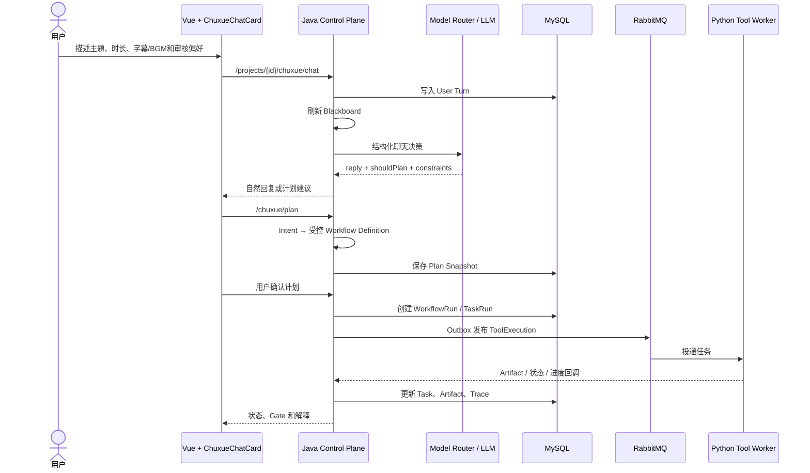

# Agent-Driven 智能视频制作流水线

这是一个面向多素材视频创作的全链路工程项目。用户在项目中上传视频素材，通过“初雪”对话式 Agent 描述创作目标，系统将自然语言转换为受控的 Workflow Definition，再由 Java 控制面调度 Python 工具和 RabbitMQ Worker 完成媒体分析、镜头筛选、故事编排、时间线合成、字幕/BGM 处理与最终渲染。

项目的核心不是让大语言模型直接执行命令，而是建立一条可校验、可暂停、可恢复、可解释的执行链：

```text
用户对话
  → 初雪 Agent（上下文理解、约束提取、计划建议）
  → Java Control Plane（Session / Blackboard / Planner / Gate / Trace）
  → Workflow / Task 调度
  → RabbitMQ + Python Worker
  → Artifact 与状态回写
  → 初雪和 Workflow Monitor 同步展示
```

当前正式代码目录：

```text
C:\Users\XRZ\Desktop\ninth\WwDa3B884n8dj
```

## 1. 当前能力概览

### 1.1 架构图


**纯文字总览：**

```text
                         浏览器
               Vue 3 + TypeScript + Pinia
          初雪 AI 对话 · Workflow Monitor · Gate 审核
                         │ REST / Cookie / CSRF
                         ▼
          ┌──────────────────────────────────┐
          │   Java 21 · Spring Boot 3.4      │
          │   Control Plane        :8080     │
          │                                  │
          │  [可选] 初雪 Agent（Session ·     │
          │      Blackboard · Planner · Gate）│
          │  Workflow 引擎（Definition → Run  │
          │      → Task · Execution · 并发锁）│
          │ Tool Client · Callback Controller│
          │  Auth · Storage Router · Outbox  │
          └──────────────────────────────────┘
       ┌──────────┼───────────────┬──────────────┐
       │          │               │              │
    MySQL 8   RabbitMQ 3.13    Redis 7     本地 Volume
   业务事实    Outbox → 队列     Blackboard    / 阿里云 OSS
   Projects   Task 分发         Gate 草稿     媒体二进制
   Workflows  Worker 消费      并发锁         Artifact
   Sessions                    限流           JSON / SRT
   Artifacts
   Trace · Gate Feedback
       │          │               │              │
       │          ▼               │              │
       │  ┌─────────────────────────────────┐    │
       │  │  Python 3.12 · FastAPI          │    │
       │  │  Tool Service         :8090     │    │
       │  │                                 │    │
       │  │  Execution Service（资源组调度） │    │
       │  │                                 │    │
       │  │FFmpeg / FFprobe（探测·代理·渲染）│    │
       │  │  Whisper（语音转写·字幕合成）     │    │
       │  │  VLM / CLIP（场景·物体·人物识别） │    │
       │  │  Model Router（LLM 路由与降级）  │    │
       │  │  Story Plan · Shot Ranking      │    │
       │  │  （RAG 镜头证据检索）           │    │
       │  │  Timeline · BGM · Subtitle      │    │
       │  │                                 │    │
       │  │  SQLite WAL（执行日志·幂等·恢复） │    │
       │  │  Rabbit Worker（异步消费·回调）   │    │
       │  └─────────────────────────────────┘    │
       │          │                              │
       └──────────┴── Artifact 元数据与结果 ──────┘
```

默认生产路径是 `Outbox → RabbitMQ → Rabbit Task Worker → Execution Service`。当 `RABBITMQ_ENABLED=false` 时，Java `ToolServiceClient` 直接调用 FastAPI Tool Execution API；两条路径最终都进入同一个 Python `Execution Service`，结果通过回调或轮询回到 Control Plane。

### 1.2 技术栈汇总

| 层次 | 技术 | 在项目中的职责 |
| --- | --- | --- |
| 前端 | Vue 3、TypeScript、Vite | 页面、初雪聊天、Workflow 和 Gate 交互 |
| 前端状态 | Pinia、Vue Router | Session、项目、Workflow、审核状态和路由 |
| 控制面 | Java 21、Spring Boot 3.4、Spring MVC | REST API、业务编排、权限和生命周期控制 |
| 持久化 | Spring Data JPA、Hibernate、MySQL 8 | Project、Asset、Session、Workflow、Task、Artifact、Trace |
| 数据库迁移 | Flyway | 版本化创建和升级 MySQL Schema |
| 缓存与并发 | Redis 7、Redis Lock/Draft | Blackboard 快照、草稿、锁、限流和短期缓存 |
| 消息 | RabbitMQ 3.13、Spring AMQP、Pika | Outbox 投递、异步任务、Worker 消费与回调 |
| 执行面 | Python 3.12、FastAPI、Uvicorn | 工具 API、执行服务和 Worker 运行时 |
| Agent 编排 | LangGraph 0.6 | 初雪的上下文准备、约束提取、分类和决策边界 |
| 模型路由 | DeepSeek/OpenAI/Claude 配置路由、Whisper、CLIP | 文本、VLM、长音频能力选择和降级 |
| 媒体处理 | FFmpeg、FFprobe | 探测、代理、镜头、字幕、时间线和渲染 |
| 视觉/语音 | PyTorch、Transformers、faster-whisper、Pillow | 视觉分析、质量评分和转写 |
| 对象存储 | 本地共享 Volume、阿里云 OSS SDK | 保存视频、音频、图片和 JSON Artifact |
| 观测 | Spring Actuator、Micrometer、Prometheus、Agent Trace | 健康检查、指标、模型审计和全链路解释 |
| 部署 | Docker Compose | 本地开发、Worker profile 和生产 Compose |

### 初雪 Agent

- 支持中文多轮对话和历史 Session；
- 能理解目标时长、字幕、BGM、风格和人工审核要求；
- 通过 LangGraph 完成有限的上下文准备、约束提取、请求分类和提案校验；
- LLM 只输出结构化结果，不能直接选择任意工具、命令或执行路径；
- 工作流执行期间能读取 Blackboard 中的真实状态，并拒绝重复创建并发 Workflow；
- 可以解释当前进度、素材摘要、BGM 选择和失败/fallback 状态。

### Workflow

默认多素材模板包含以下节点：

```text
video_probe
video_proxy_generate
video_shot_detect
vision_quality_score
vision_vlm_analyze
source_transcribe（可选）
shot_ranking
story_plan
highlight_selection
timeline_compose
bgm_select（可选）
subtitle_compose（可选）
video_render
```

用户确认计划后，Definition 会被冻结并展开为具体 TaskRun。运行中不能随意改变 DAG；需要改变创作目标时，先等待当前 Workflow 成功或失败，再在 Session 中创建新的计划。

### 人工 Gate

默认可选的人工 Gate 包括：

- `gate_shot_ranking`：镜头排序审核；
- `gate_story_edit`：故事计划编辑；
- `gate_timeline_preview`：时间线预览；
- `gate_bgm_review`：BGM 候选选择；
- `gate_render_review`：最终成片预览。

用户可以在初雪中提出“中间审核”或“开启人工审核”。前者默认在时间线阶段暂停，后者按工作流顺序启用所有可用审核 Gate。聊天中的 Gate 直接复用 Workflow Monitor 的完整组件，和工作流页面操作同一个 WorkflowRun/Gate。

## 2. 本地 Docker 快速启动

### 2.1 前置条件

- Docker Desktop；
- Docker Compose v2；
- 如需本地前端开发，安装 Node.js 22；
- 如需运行 Python 测试，使用 `agent-video-pipeline` Conda 环境。

### 2.2 配置环境变量

复制或编辑项目根目录 `.env`，至少确认以下配置：

```dotenv
LLM_PROVIDER=deepseek
LLM_MODEL=deepseek-chat
LLM_API_KEY=你的模型密钥
RABBITMQ_ENABLED=true
REDIS_ENABLED=true
```

本地默认使用 MySQL、Redis、RabbitMQ 和本地 Artifact 存储。配置 OSS 后可以把媒体对象切换到 OSS，但数据库仍保存 Artifact 元数据和业务状态。

### 2.3 启动核心服务

```powershell
cd C:\Users\XRZ\Desktop\ninth\WwDa3B884n8dj
docker compose up -d --build
docker compose ps
```

如需启动独立的 MEDIA、MODEL、RENDER Worker：

```powershell
docker compose --profile workers up -d --build
docker compose --profile workers ps
```

### 2.4 服务地址

| 服务 | 地址 | 作用 |
| --- | --- | --- |
| Web / Control Plane | `http://127.0.0.1:8080` | Vue 静态页面、REST API、业务控制面 |
| Tool Service | `http://127.0.0.1:8090` | Python 工具、LLM、Worker 执行入口 |
| Tool Service 健康检查 | `http://127.0.0.1:8090/api/v1/health` | 执行面健康状态 |
| Spring 健康检查 | `http://127.0.0.1:8080/actuator/health` | 控制面健康状态 |
| RabbitMQ 管理台 | `http://127.0.0.1:15672` | 队列、消费者和消息观察 |
| MySQL | `127.0.0.1:3307` | 业务事实数据 |
| Redis | `127.0.0.1:6379` | 快照、草稿、锁和限流 |

### 2.5 停止服务

```powershell
docker compose stop
```

开发排障时优先使用 `stop`、`restart` 和日志查看。除非确认可以删除本地数据，否则不要使用 `docker compose down -v`。

## 3. 本地开发与测试

### 前端

```powershell
cd web-app
npm ci
npm run dev
npm run build
```

生产构建会由 `control-plane/Dockerfile` 自动完成，并复制到 Spring Boot 的静态资源目录。

### Java Control Plane

```powershell
cd control-plane
cmd.exe /d /c call "C:\software\IDEA\IntelliJ IDEA 2025.2.2\plugins\maven\lib\maven3\bin\mvn.cmd" -q test
```

### Python Tool Service

```powershell
cd tool-service
& "C:\software\Anaconda\envs\agent-video-pipeline\python.exe" -m pytest -q
```

当前已验证的测试基线：

```text
Control Plane：Maven tests passed
Tool Service：123 passed, 2 skipped, 1 warning
Web App：production build passed
```

## 4. 一次创作请求如何运行



## 5. 目录导航

```text
control-plane/src/main/java/.../
  agent/          初雪 Agent、Session、Blackboard、Gate、解释服务
  workflow/       Definition、模板、动态 Planner、Validator、治理策略
  execution/      WorkflowRun、TaskRun、依赖、调度、重试、恢复、取消
  artifact/       Artifact 元数据和查询
  outbox/         事务消息 Outbox 与 RabbitMQ 拓扑
  trace/          Agent Trace 和审计事件
  storage/        本地存储 / OSS 路由
  cache/          Redis 草稿、锁、冲突检测
  api/            REST Controller

tool-service/app/
  agent/          LangGraph 初雪运行边界
  api/            FastAPI 路由、聊天和 Workflow Intent 接口
  llm/            Model Router、Provider、JSON 解析、审计
  registry/       Tool Registry、Manifest、Tool Governance
  execution/      执行服务、资源组和 SQLite 执行日志
  messaging/      RabbitMQ Worker
  tools/          FFmpeg、FFprobe、Whisper、VLM、规划和渲染工具
  rag/            项目内镜头证据的确定性混合检索
  music/          BGM Provider 和候选曲库

web-app/src/
  components/     App Shell、初雪宠物、聊天卡片、通用组件
  features/       项目、素材、Workflow、Gate、审核、审计、版本页面
  stores/         Pinia 状态：project、chuxue、workflow、review、auth
  api/            前端 REST API 封装

contracts/        LLM 和跨服务契约
deploy/           部署配置
docs/             阶段性开发记录和测试材料
```

## 6. 当前设计边界

1. MySQL 是 Workflow、Task、Artifact、Session、Trace 和 Gate 反馈的事实来源；Redis 只保存可重建的快照、草稿、锁和限流数据。
2. LLM 不拥有工具调用权限。模型返回值必须经过 JSON Schema、业务约束和后端 Planner 校验。
3. Workflow Definition 在执行前生成并冻结。运行中只允许修改当前 Gate 对应的 Story Plan、Timeline 或 BGM Artifact。
4. 一个 Agent Session 在当前 Workflow 成功或失败前不会创建第二个执行任务。
5. Artifact 是任务之间传递结果的主要边界，媒体文件和结构化 JSON 均通过 Artifact 关联。
6. RAG 当前是项目内的混合证据检索，用于辅助 Story Plan/镜头角色选择，不是外部爆款视频训练系统。
7. OSS 是可选存储后端；本地开发可使用共享 Docker volume。

## 7. 项目定位

这是一个以工程化 Agent Runtime 为核心的智能视频制作项目，重点展示：

- Agent 与确定性 Control Plane 的职责分离；
- Session / Blackboard 驱动的多轮上下文；
- 受治理的 Tool Registry 和 Model Router；
- 可恢复的 DAG Workflow 与 RabbitMQ Worker；
- Artifact、Gate、Trace 组成的可解释执行链。

后续的 Agent 质量评估、增量执行与 Artifact 复用、Workflow 版本 Diff、交付运维等属于可选的进一步生产化增强，不是当前核心功能运行的前置条件。
