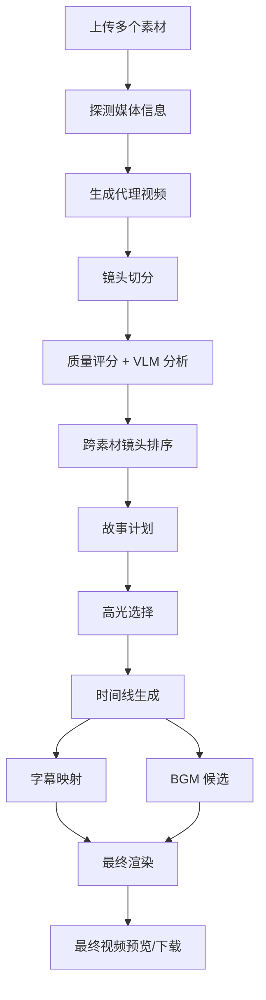
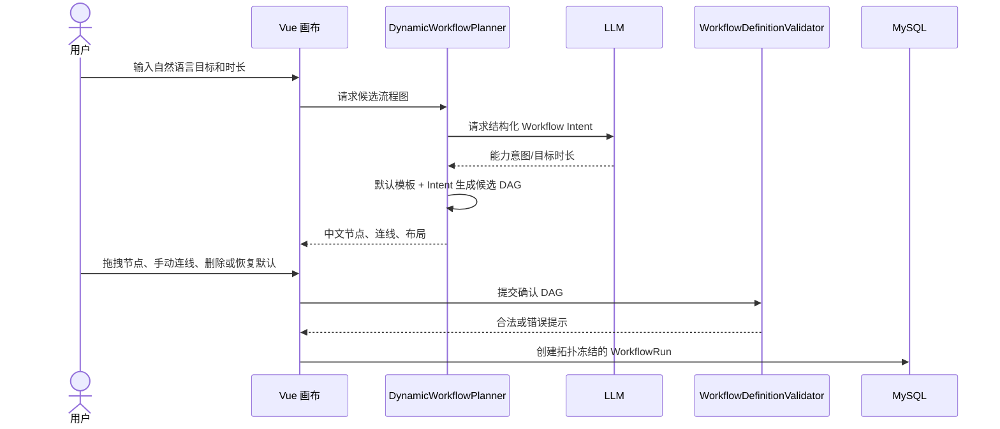
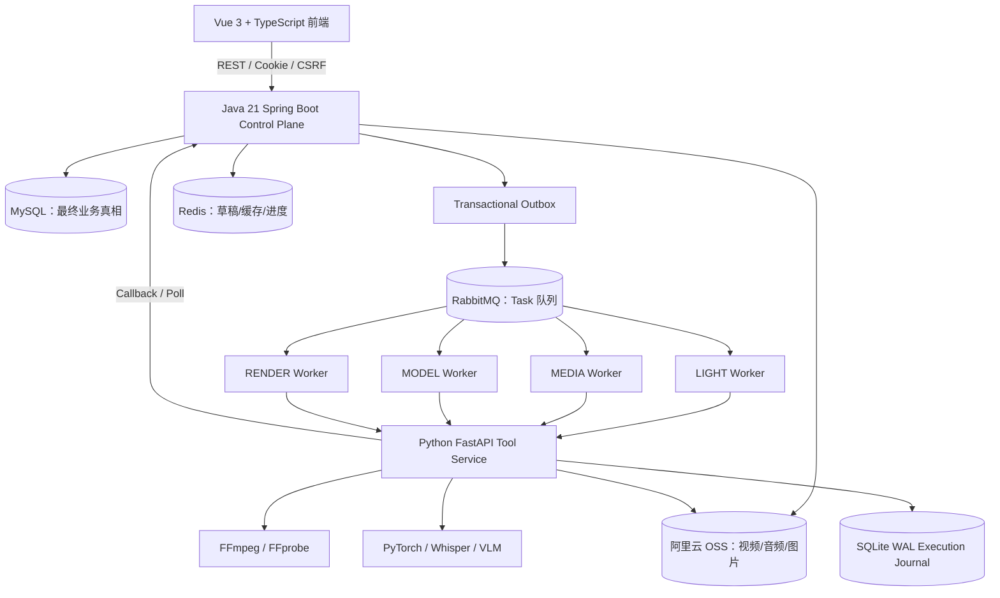

# Agent-Driven 智能视频制作流水线

这是一个面向多素材视频创作的学习型项目。用户上传多个视频素材，输入成片目标和时长，系统自动完成素材探测、代理视频生成、镜头切分、质量分析、语义理解、镜头排序、故事编排、时间线生成、BGM/字幕处理和最终渲染。

本文是新人接手项目时的第一入口。建议先按“快速启动 → 业务流程 → 目录导航 → 架构原理”的顺序阅读。

正式项目目录：

```text
C:\Users\XRZ\Desktop\ninth\WwDa3B884n8dj
```

不要把以下目录当作当前代码：

- `C:\Users\XRZ\Desktop\third\WwDa3B884n8dj`：历史副本；
- `C:\Users\XRZ\Desktop\summer\WwDa3B884n8dj`：旧版/测试素材参考目录；
- `C:\Users\XRZ\Desktop\sbell2`：旧备份目录。

## 1. 五分钟了解项目

### 1.1 一句话理解

这是一个“Java 控制面 + Python 工具执行面 + DAG Workflow + RabbitMQ Worker”的视频生产系统：

- Java 决定任务能不能执行、什么时候执行、执行结果如何落库；
- Python 调用 FFmpeg、Whisper、VLM 等工具完成实际计算；
- MySQL 保存最终业务状态；
- RabbitMQ 投递异步任务；
- Redis 保存可丢失草稿和缓存；
- OSS 保存视频、音频和图片等媒体对象。

### 1.2 一次视频生成的主流程



### 1.3 当前产品边界

- 动态 DAG 只发生在执行前；用户确认后拓扑冻结；
- 运行中的 Gate 可以编辑 Story Plan、Timeline、BGM 等业务 Artifact，但不能增删运行中节点；
- 不实现运行中 Replan；需求改变时创建新的 Workflow；
- 半自动模式保留运行中人工 Gate，全自动模式跳过人工暂停，但仍执行后端校验；
- LLM 只输出受约束的结构化意图，不直接执行 Shell、FFmpeg、SQL 或任意工具。

## 2. 当前运行方式

### 2.1 已验证的本地容器

当前 Compose 可启动：

| 服务 | 地址/作用 |
| --- | --- |
| Control Plane | `http://127.0.0.1:8080` |
| Tool Service | `http://127.0.0.1:8090` |
| RabbitMQ 管理台 | `http://127.0.0.1:15672` |
| RabbitMQ AMQP | `127.0.0.1:5672` |
| Redis | `127.0.0.1:6379` |
| MySQL | `127.0.0.1:3307` |

RabbitMQ、Redis 和四类 Worker 已接入本地 Compose。RabbitMQ 临时密码通过 `.env` 的 `RABBITMQ_DEFAULT_PASS` 配置，当前学习环境使用的密码不要复制到其他环境。

### 并发参数

任务并发由三层参数共同控制：Worker 的 Python 资源组槽位、重任务总上限，以及 RabbitMQ 消费者的 `prefetch`。当前 Compose 默认值是 LIGHT=4、MEDIA=3、MODEL=2、RENDER=2、重任务总上限=4、`prefetch=2`。可通过以下环境变量调整：

```dotenv
TOOL_EXECUTION_LIGHT_LIMIT=4
TOOL_EXECUTION_MEDIA_LIMIT=3
TOOL_EXECUTION_MODEL_LIMIT=2
TOOL_EXECUTION_RENDER_LIMIT=2
TOOL_EXECUTION_HEAVY_LIMIT=4
TOOL_RABBITMQ_PREFETCH=2
```

模型和渲染通常更占内存、CPU、磁盘，并发不是越大越好；调整后应观察 Worker 资源、RabbitMQ Ready/Unacked 消息和任务耗时。

`prefetch` 不是实际执行线程数。Worker 在成功提交到本地 `ExecutionService` 后确认 Rabbit 消息，实际同时执行数量由资源组槽位决定。要提高吞吐，优先调整槽位或增加同一资源组 Worker 副本；横向扩展前必须规划每个副本的独立 ExecutionStore，避免多个进程争用同一个 SQLite 文件。

### 2.2 启动全部服务

在正式项目根目录执行：

```powershell
cd C:\Users\XRZ\Desktop\ninth\WwDa3B884n8dj
docker compose --profile workers up -d --build
docker compose --profile workers ps
```

检查健康状态：

```powershell
Invoke-WebRequest http://127.0.0.1:8080/actuator/health
Invoke-WebRequest http://127.0.0.1:8090/api/v1/health
docker exec avp-rabbitmq rabbitmqctl list_queues name consumers messages
```

### 2.3 停止服务

```powershell
docker compose --profile workers stop
```

不要随意使用 `down -v`，它会删除 Compose 管理的数据库、Redis、RabbitMQ 数据卷。学习排障时优先使用 `stop`、`restart` 和查看日志。

### 2.4 前端本地开发

```powershell
cd web-app
npm ci
npm run build
npm run dev
```

前端生产构建会在 `control-plane/Dockerfile` 中自动执行，并复制到 Java 静态资源目录。`node_modules`、构建产物和本地运行数据不要提交到 Git。

### 2.5 后端测试

```powershell
cd control-plane
mvn test

cd ..\tool-service
python -m pytest -q
```

## 3. 业务概念

| 概念 | 新人理解 |
| --- | --- |
| Project | 用户的创作空间，可以拥有多个素材和多个 Workflow |
| Asset | 用户上传的原始视频、音频或图片 |
| WorkflowRun | 一次完整的成片尝试 |
| WorkflowDefinition | 执行前确认的逻辑 DAG 定义 |
| TaskRun | Workflow 展开后的一个实际执行步骤 |
| Artifact | Task 产生的不可变结果，例如镜头列表、Story Plan、Timeline、视频 |
| Gate | 需要用户审核或编辑的业务暂停点 |
| Attempt | 同一个 Task 的第几次尝试 |
| Outbox | 与业务事务一起写入、等待发布到 RabbitMQ 的消息记录 |

一个关键区别：13 个逻辑节点不等于 13 个运行时 Task。上传两个视频后，素材级节点会展开成两份甚至更多 Task，最后汇聚到工作流级排序、故事和渲染任务。

## 4. 动态 DAG 如何工作



字幕有一个特别重要的依赖：`subtitle.compose` 必须依赖 `audio.source-transcribe` 产生的 `SOURCE_TRANSCRIPT`。用户没有转写需求时，后端会禁用字幕链路，而不是让字幕节点空跑。

## 5. 架构总览



更详尽的原理、数据流图、时序图和故障图见根目录的 [`技术架构原理说明.md`](技术架构原理说明.md)。

## 6. 目录导航：接手时先看哪里

```text
web-app/
  src/features/workflow/       动态 DAG、Workflow 监控、Gate 页面
  src/features/audit/          LLM 审计页面
  src/api/                     前端 API 封装
  src/stores/                  Pinia 状态

control-plane/src/main/java/
  .../api/                     REST Controller、认证入口、内部接口
  .../workflow/                Definition、Planner、Validator、模板
  .../execution/               Workflow、Task、依赖、调度、恢复
  .../artifact/                Artifact 元数据
  .../outbox/                  Outbox 和 Rabbit 拓扑
  .../storage/                 Local/OSS Artifact Storage
  .../cache/                   Redis 草稿/缓存服务

tool-service/app/
  api/                         FastAPI 路由
  core/                        配置和数据模型
  registry/                    Tool Manifest 注册
  execution/                   执行队列、SQLite Journal、资源限制
  messaging/                   RabbitMQ Worker
  tools/                       具体媒体、模型、规划和渲染工具

contracts/                     跨服务 Schema 和协议
docs/                          阶段交接、部署、压测和设计文档
docker-compose.yml             本地服务和 Worker profile
docker-compose.prod.yml        生产 Compose 模板
.env                           本地环境变量，不提交敏感信息
```

## 7. 推荐阅读顺序

### 第一步：看数据模型

1. `control-plane/.../workflow/WorkflowDefinition.java`；
2. `control-plane/.../execution/WorkflowRunEntity.java`；
3. `control-plane/.../execution/TaskRunEntity.java`；
4. `control-plane/.../artifact/ArtifactEntity.java`。

### 第二步：跟踪一条执行主线

1. `WorkflowExecutionService.createMultiAssetAnalysisRun()`：创建 Workflow；
2. `expandTasks()`：逻辑 DAG 展开为 TaskRun；
3. `evaluateWorkflow()`：判断 READY、Gate 和终态；
4. `prepareDispatch()`：构造 Tool 请求；
5. `applyToolResult()`：保存 Artifact 并推进下游；
6. `recoverWorkflow()`：服务重启后恢复。

### 第三步：理解消息和执行

1. `execution/RabbitDispatchService.java`；
2. `outbox/OutboxService.java`；
3. `outbox/RabbitTopologyConfiguration.java`；
4. `tool-service/app/messaging/rabbit_worker.py`；
5. `tool-service/app/execution/service.py`。

### 第四步：理解前端交互

1. `WorkflowTopologyPlanner.vue`：动态 DAG 画布；
2. Workflow 监控页面：Task/Gate/Artifact 展示；
3. Story Plan 和 Timeline 页面：业务 Artifact 编辑；
4. `LlmAuditPanel.vue`：后端聚合审计列表。

## 8. 关键数据流

### 8.1 媒体上传

```text
浏览器 FormData
  → ProjectController
  → AssetService
  → 视频/音频/图片写入 OSS
  → AssetEntity 保存 storageUri、hash、大小、媒体类型
  → 浏览器获得短时预签名 URL
```

### 8.2 Task 执行

```text
Task READY
  → Task DISPATCHING + Outbox PENDING（同一 MySQL 事务）
  → Publisher Confirm
  → RabbitMQ 资源队列
  → Worker claim
  → OSS 输入物化
  → Python Tool 执行
  → 输出上传 OSS
  → Callback（RabbitMQ 模式）/ Poller（HTTP 回退模式）
  → MySQL Artifact + Task 状态
  → 下游 Task 变 READY
```

### 8.3 Redis 的边界

Redis 只保存可以丢失、可以重建的数据：DAG 草稿、Gate 草稿、LLM 审计列表缓存、进度快照和心跳。Workflow、Task、Artifact 和 Outbox 不能只放 Redis。

## 9. RabbitMQ/Redis 开关与回滚

```dotenv
RABBITMQ_ENABLED=true
REDIS_ENABLED=true
RABBITMQ_DEFAULT_PASS=本地密码
RABBITMQ_WORKER_TOKEN=内部 Worker token
```

排障时可以切换：

- RabbitMQ 异常：设置 `RABBITMQ_ENABLED=false`，回到 HTTP Tool dispatch；
- Redis 异常：设置 `REDIS_ENABLED=false`，使用内存/数据库回退；
- Worker 崩溃：RabbitMQ 会重新投递，幂等键和 Attempt 防止旧结果污染；
- RabbitMQ 模式下每个资源组 Worker 使用独立执行存储，Control Plane 不再用主 Tool Service 轮询其他 Worker 的 executionId；Worker 回调是结果的权威路径；
- Outbox 发布失败：记录 `FAILED`、`attempts`、`nextAttemptAt`，等待重试；
- Poison message：进入 DLQ，不无限 requeue。

## 10. 常见排障命令

```powershell
# 查看所有容器
docker compose --profile workers ps

# 查看 Java 日志
docker compose logs --tail=200 control-plane

# 查看 Python/Worker 日志
docker compose logs --tail=200 tool-service tool-worker-media tool-worker-model tool-worker-render

# 查看 RabbitMQ 队列、消费者和积压
docker exec avp-rabbitmq rabbitmqctl list_queues name consumers messages

# 查看 Redis 是否可用
docker exec avp-redis redis-cli ping

# 查看健康检查
Invoke-WebRequest http://127.0.0.1:8080/actuator/health
Invoke-WebRequest http://127.0.0.1:8090/api/v1/health
```

如果 Control Plane 启动时报 Rabbit 队列参数不一致，先确认队列中没有未处理消息，再由维护者精确删除旧队列并重建；不要直接删除全部 Docker Volume。

## 11. 当前完成状态

- 第十三阶段：动态 DAG、中文拓扑画布、默认 DAG 回退、服务端校验、半自动/全自动确认已完成；
- 第十四阶段：可观测性、压测基线、Artifact Storage 抽象、阿里云 OSS 媒体对象存储已完成；
- 第十五阶段：RabbitMQ、Transactional Outbox、DLQ、资源组 Worker、Redis 草稿/缓存、LLM 审计分页聚合已完成；
- 前端 `brace-expansion` 高危依赖已通过 npm override 修复，`npm audit` 为 0 vulnerabilities；
- 本地前端构建、Java 测试、Python 编译和 Docker Compose 部署均已验证。

阶段交接文档：

- [`docs/thirteenth-stage-handoff.md`](docs/thirteenth-stage-handoff.md)
- [`docs/fourteenth-stage-handoff.md`](docs/fourteenth-stage-handoff.md)
- [`docs/fifteenth-stage-handoff.md`](docs/fifteenth-stage-handoff.md)

## 12. 安全和提交边界

- 不提交 `.env`、AccessKey、LLM API Key、RabbitMQ 密码、Worker token；
- 不把视频、音频、图片、模型缓存和运行时 SQLite 提交到 Git；
- 不修改或删除历史备份目录；
- 不使用 `git reset --hard`、`git checkout --` 等破坏性操作；
- 生产环境需要更换学习环境密码，并补充网络隔离、备份、监控和密钥管理。

## 13. 进一步学习

新人完成基础阅读后，可以尝试：

1. 关闭 RabbitMQ，验证 HTTP 回退；
2. 关闭 Redis，验证草稿和审计重建；
3. 上传两个素材，对比逻辑节点数和实际 Task 数；
4. 在 Gate 编辑 Story Plan，观察新 Artifact 和旧 Artifact 的血缘；
5. 停止 Worker，观察 RabbitMQ 重投；
6. 查看 Actuator、RabbitMQ 管理台和 Redis 内存指标；
7. 为一个新 Tool 增加 Manifest、Python 实现、Java 输入映射和测试。

详细技术原理和更多 Mermaid 图见 [`技术架构原理说明.md`](技术架构原理说明.md)。
