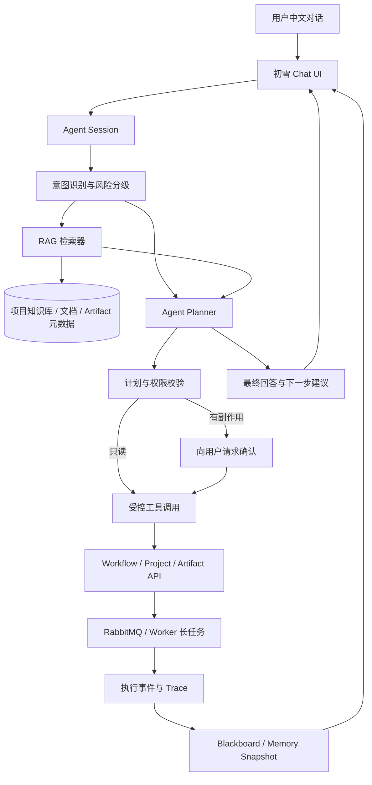

# 后端开发与 Agent 开发竞争力迭代路线

> 目标：在现有简历和 Agent-Driven 多素材智能视频制作流水线的基础上，补齐后端工程证据与 Agent Runtime 能力，形成可写进简历、可在面试中演示、可通过测试和指标验证的项目成果。

> 评估基线：简历 v1.0（2026 年 8 月）与正式项目 \`C:\Users\XRZ\Desktop\ninth\WwDa3B884n8dj\`。

## 1. 当前画像

### 已有优势

当前简历已经具备一条清晰的“Java 后端 + AI 应用开发”主线：

| 方向 | 已有证据 |
| --- | --- |
| 后端架构 | Java 21、Spring Boot、MySQL、RabbitMQ、Redis、OSS、Docker |
| 异构服务 | Java Control Plane + Python FastAPI Tool Worker |
| 媒体处理 | FFmpeg、FFprobe、Whisper、视频探测、镜头切分、渲染 |
| Workflow | 动态 DAG、Task、Gate、Attempt、Artifact、重试与恢复 |
| AI 应用 | LLM 解析自然语言需求、生成 Workflow Intent 和 Story Plan |
| 可靠性 | Transactional Outbox、幂等、消息队列、资源组 Worker、OSS 抽象 |
| 前端协作 | Vue 3、TypeScript、可视化 DAG、Gate 审核页面 |
| 运维基础 | Docker Compose、Linux、Prometheus、健康检查 |
| 第二项目 | AIOps 故障注入、Linux、Bash、IPv6、FRR、Prometheus |

你的项目已经不是“调用模型 API 的 Demo”，而是一个完整的多媒体生产 Workflow 系统。

### 主要短板

1. 技术组件较多，但缺少吞吐、延迟、成功率、资源占用等硬指标。
2. RabbitMQ、Redis、OSS 已接入，但真实故障注入、恢复和横向扩展证据仍不充分。
3. Agent 主要体现为“LLM 生成受约束的 DAG 意图”，还没有完整呈现 Session、Trace、Memory、Tool Policy 和 Runtime Harness。
4. 项目有很多实现细节，但没有提炼出一个面试官能快速理解的核心技术问题。
5. 当前简历更强调“做了什么”，需要补充“为什么这样设计、解决了什么问题、结果如何”。
6. 项目是单机 Docker Compose 学习项目，不能直接表述为 Kubernetes、多机高可用或大规模生产平台。

## 2. 项目定位

建议统一定位为：

> 面向多素材视频生产的、可人工干预、可恢复、可观测的 Agent Workflow Runtime。

四个关键词对应两类岗位：

- 后端：状态机、事务、消息、存储、幂等、恢复、性能；
- Agent：Planner、Structured Output、Tool Registry、Session、Trace、Memory、人工协作。

系统主线可以概括为：

\`\`\`text
自然语言需求
  → LLM 结构化 Workflow Intent
  → Java Planner 编译候选 DAG
  → 前端编辑与后端 Validator
  → 冻结 Workflow Definition
  → RabbitMQ Worker 执行
  → Artifact / Gate / 审计 / 渲染结果
\`\`\`

## 3. 迭代优先级

| 优先级 | 迭代主题 | 岗位能力 | 预期产物 |
| --- | --- | --- | --- |
| P0 | 性能基线与可观测性 | 后端性能、压测、指标分析 | P50/P95/P99 和资源报告 |
| P0 | 故障注入与恢复 | 分布式可靠性 | Worker/MQ/Redis/OSS 恢复报告 |
| P1 | Redis 工程化 | 锁、限流、缓存一致性 | Workflow 锁、并发限流、进度快照 |
| P1 | RabbitMQ 生产化 | MQ、DLQ、幂等、扩展 | 积压监控、重复投递、DLQ 闭环 |
| P1 | Agent Runtime | Agent 设计和工具治理 | Session、Blackboard、Trace、Policy |
| P1 | 初雪长链路 Agent + RAG | 对话式产品操作、知识检索、长任务恢复 | Chat Drawer、RAG、确认计划、SSE、受控 Tool |
| P2 | Agent 质量评估 | LLM 回归和评测 | Intent/DAG/Story Plan 数据集 |
| P2 | 增量执行 | DAG 算法、Artifact 血缘、成本优化 | 受影响子图重跑和 Artifact 复用 |
| P2 | Workflow Diff | 可解释性和产品化 | DAG/参数/Artifact 版本差异 |
| P3 | 交付运维 | CI/CD、监控、备份 | CI、面板、部署和恢复文档 |

## 4. P0：性能基线与可观测性

### 4.1 固定测试矩阵

| 变量 | 测试值 |
| --- | --- |
| 素材数量 | 1、2、4、8 |
| 单个视频大小 | 20MB、100MB、500MB |
| Workflow 并发 | 1、2、4 |
| MODEL 并发 | 1、2 |
| MEDIA 并发 | 1、2、3 |
| Worker 副本 | 1、2 |
| 存储后端 | Local、OSS |
| LLM 模式 | 真实 LLM、确定性回退 |

### 4.2 必采指标

- Workflow 总耗时和端到端 P50/P95/P99；
- 第一个 Task 的排队耗时；
- 每个 Tool 的执行耗时；
- READY、DISPATCHING、RUNNING、RETRY_WAIT 时长；
- Workflow 成功率、失败率、重试率；
- Outbox Pending 数量和发布延迟；
- RabbitMQ Ready、Unacked、DLQ 数量；
- Redis 命中率、TTL、连接错误；
- OSS 上传、签名 URL、Range 读取延迟；
- Worker CPU、内存、磁盘和模型加载时间。

建议新增：

\`\`\`text
scripts/stage16-k6.js
docs/stage16-performance-baseline.md
docs/stage16-observability-dashboard.md
\`\`\`

报告必须回答：

- 并发增加后瓶颈在 Java、RabbitMQ、Worker、模型、磁盘还是 OSS？
- 提高并发后吞吐是否提升，失败率和内存是否恶化？
- 多素材任务是否真的并行，还是被依赖屏障或资源权重限制？

### 4.3 简历写法

没有实测数据时：

> 建立多素材 Workflow 压测基线，覆盖 1/2/4/8 路素材和 1/2/4 路 Workflow 并发，采集 Task、Outbox、RabbitMQ、Worker 与 OSS 全链路指标，定位模型推理和媒体处理瓶颈。

有数据后：

> 在 4 路 Workflow 并发、3 路媒体 Worker 和 2 路模型并发下，端到端 P95 为 XX 秒，成功率 XX%，RabbitMQ 最大积压 XX 条，Worker 重启后恢复率 XX%。

## 5. P0：故障注入与恢复测试

至少覆盖：

| 场景 | 预期行为 |
| --- | --- |
| Outbox 发布失败 | 消息保持待发布并退避重试 |
| Worker ACK 前宕机 | RabbitMQ 重投，幂等键收敛 |
| Tool 超时 | 记录原因并按策略重试或终止 |
| Callback 暂时失败 | 受限重试，不重复写结果 |
| Redis 清空 | 草稿/缓存回退或从 MySQL/Artifact 重建 |
| OSS 短时不可用 | 任务可重试，不产生伪成功 Artifact |
| Gate 重复提交 | 同一 Gate 只有一个请求推进成功 |
| 重复 Rabbit 消息 | 不重复产生业务结果 |
| 模型加载失败 | 记录审计并安全回退或明确失败 |
| Control Plane 重启 | Workflow 状态和待执行任务可恢复 |

每个故障都要形成：

\`\`\`text
固定 Workflow
  → 注入故障
  → 等待预期状态
  → 检查 MySQL、RabbitMQ、Redis、Artifact 和日志
  → 输出 PASS/FAIL、恢复耗时和残留数据
\`\`\`

这部分可以证明你理解：至少一次投递不等于恰好一次执行，ACK 不等于业务完成，重试必须配合幂等，缓存不能替代业务真相。

## 6. P1：Redis 工程化

### 6.1 Workflow 分布式锁

防止重复继续 Gate、恢复线程和用户请求并发推进同一个 Workflow。

建议 Key：

\`\`\`text
avp:v1:workflow:lock:{workflowRunId}
\`\`\`

实现要求：

- SET NX EX；
- token 防误删；
- TTL 和续期；
- 获取失败快速返回；
- 数据库事务仍是最终一致性保障。

### 6.2 用户和项目级限流

建议限制：

- 单用户同时运行 Workflow 数；
- 单项目同时处理素材数；
- 单用户 LLM 调用次数；
- 单用户 OSS 上传请求数。

优先使用 Redis Lua 或滑动窗口，形成可面试的并发竞争与过期语义案例。

### 6.3 进度快照和缓存一致性

\`\`\`text
MySQL：Workflow/Task 最终状态
Redis：短 TTL 进度快照
Task 状态变化：主动更新或删除快照
Redis 丢失：从 MySQL 重建
\`\`\`

每种缓存都要明确：

- 何时写入；
- 何时删除；
- TTL 多长；
- 是否允许短暂读旧；
- Redis 不可用如何回退。

## 7. P1：RabbitMQ 与 Worker 生产化

当前已有 Topic Exchange、资源组队列、Transactional Outbox、Publisher Confirm、持久化消息、Worker claim、ACK/NACK、DLQ、幂等键和 Attempt。

建议补齐：

1. DLQ 查询、重放和隔离脚本；
2. Outbox 发布延迟、失败次数和积压指标；
3. Ready、Unacked、消费者数量监控；
4. 消息等待时间与执行时间分离；
5. 不同资源组独立扩容实验；
6. 重复投递和 Poison Message 测试；
7. traceId、workflowRunId、taskRunId 全链路透传；
8. 有限的任务优先级或公平调度。

建议固定 8 个素材任务，比较 1/2 个 MODEL Worker、1/2 个 MEDIA Worker 的总耗时、内存峰值、积压、失败率和等待时间。

## 8. P1：Agent Runtime 化

### 8.1 Agent Session

记录一次用户创作会话：

\`\`\`text
sessionId
userId / projectId / workflowRunId
自然语言需求
目标时长
DAG 版本
当前 Gate
会话状态
\`\`\`

Session 不替代 Workflow，而是把用户、LLM、Planner、Gate 和执行结果串成可追踪上下文。

### 8.2 Blackboard

共享上下文可先用 MySQL + Redis 快照：

\`\`\`text
用户目标
素材摘要
能力集合
当前 Workflow Definition
已完成 Artifact
Gate 决策
失败原因
模型审计记录
\`\`\`

### 8.3 Trace

建议统一字段：

\`\`\`text
traceId / sessionId / workflowRunId / taskRunId
agentName / toolName / promptHash / model
inputArtifactIds / outputArtifactIds
latencyMs / tokenUsage / fallbackReason
\`\`\`

这样可以解释“为什么加入字幕、使用了哪个转写 Artifact、最终由哪个 Task 渲染”。

### 8.4 Tool Policy

在 Tool Manifest 上增加：

- 是否允许全自动；
- 是否必须人工 Gate；
- 输入输出 Schema；
- 最大执行时长；
- 最大重试次数；
- 资源组；
- 是否允许降级；
- 是否需要用户确认。

这会把 Tool Registry 提升为 Tool Governance。

### 8.5 Model Router

先做确定性路由：

\`\`\`text
结构化意图解析 → 文本模型
镜头语义分析 → VLM/CLIP
长音频转写 → Whisper
Story Plan → 文本模型 + 后端 Schema 校验
\`\`\`

记录模型不可用、超时、成本和质量，避免只展示“调用成功”。

## 9. P1：初雪长链路 Agent 与 RAG

这是非常值得加入的方向。它能把现有项目从“用户操作工作台 + 后台 Workflow”提升为“由助手陪伴完成创作任务的 Agent 产品”。初雪继续作为唯一对话入口和产品角色，后端则提供受控的检索、计划和工具执行能力。

### 9.1 产品目标

用户可以直接对初雪说：

```text
初雪，帮我把这个项目里的两个视频做成 30 秒旅行短片。
初雪，为什么这个 Workflow 一直卡在理解画面语义？
初雪，查看最近一次失败任务，并告诉我是否可以重试。
初雪，把当前流程改成不加 BGM，但保留字幕。
初雪，帮我打开这个项目最近一次成片和对应的时间线。
```

初雪应能够：

1. 理解当前用户、项目、素材、Workflow 和页面上下文；
2. 从项目文档、工具说明、Workflow 状态和 Artifact 元数据中检索事实；
3. 先生成可解释的操作计划；
4. 对有副作用的操作请求用户确认；
5. 调用后端白名单工具，而不是直接操作数据库或任意浏览器 DOM；
6. 跟踪长链路执行状态，并在中断后恢复对话；
7. 用中文向用户解释正在做什么、为什么等待以及下一步是什么。

### 9.2 推荐的长链路架构



核心原则是：

```text
LLM 负责理解、检索和规划
Java 负责权限、校验、状态和副作用
Python/Worker 负责媒体和模型计算
初雪负责对话呈现、确认和结果解释
```

### 9.3 RAG 知识库分层

不要只把 README 全量切片后交给模型。建议分成四类知识：

| 知识层 | 内容 | 更新方式 |
| --- | --- | --- |
| 产品知识 | 项目概念、页面入口、操作说明、错误提示 | 文档构建时更新 |
| 工具知识 | Tool Manifest、输入输出、参数、资源组、前置条件 | Tool 注册或版本变更时更新 |
| Workflow 知识 | 当前 DAG、Task 状态、Gate、依赖、失败原因 | Workflow 事件触发更新 |
| Artifact 知识 | 镜头、转写、Story Plan、Timeline、渲染结果元数据 | Artifact 产生时更新 |

建议保留结构化字段，不要只依赖向量相似度：

```text
documentId
tenant/userId
projectId
workflowRunId
artifactId
knowledgeType
sourceVersion
contentHash
updatedAt
```

检索采用混合方式：

```text
结构化过滤：userId/projectId/workflowRunId/权限
关键词检索：错误码、Task 名称、Artifact 类型
向量检索：用户自然语言问题、产品说明、故障解释
时间排序：最近 Workflow 和最新 Artifact 优先
```

RAG 返回结果必须携带来源，初雪回答中可以显示：

```text
依据：Workflow 651... 的 vision_vlm_analyze Task
依据：Artifact SHOT_RANKING，生成时间 2026-08-06 14:32
依据：工具说明 vision.vlm-analyze@1.0
```

### 9.4 技术选型建议

第一版不建议为了 RAG 立即引入复杂的独立向量数据库。可按以下顺序演进：

#### 第一阶段：结构化检索优先

- MySQL 保存知识源和权限字段；
- Redis 缓存热门检索结果；
- 文档使用标题、标签、关键词和全文检索；
- Artifact 使用结构化元数据和 JSON 查询；
- LLM 只负责综合后端已检索事实。

#### 第二阶段：增加向量检索

可选方案：

- Chroma：适合本地学习和快速迭代；
- pgvector：适合希望把向量和业务数据放在同一数据库的场景；
- Elasticsearch/OpenSearch：适合全文、过滤和向量混合检索；
- Milvus：适合明确存在大规模向量需求时再引入。

当前学习项目建议优先选择 **Chroma 或 pgvector**，并把 RAG 抽象在 `KnowledgeRetriever` 接口之后，避免将业务代码绑定到某个向量数据库。

### 9.5 初雪可调用的工具边界

初雪不应获得任意 HTTP、SQL、Shell 或浏览器脚本权限。建议注册以下白名单 Tool：

#### 只读工具

```text
project.list
project.get
asset.list
workflow.list
workflow.get
workflow.get_progress
workflow.get_failures
workflow.get_artifacts
llm_audit.search
knowledge.search
```

#### 需要确认的操作工具

```text
workflow.preview_plan
workflow.confirm_plan
workflow.retry_failed_task
workflow.continue_gate
workflow.create_from_current
project.open_page
artifact.open_preview
```

#### 高风险操作

默认禁止或必须二次确认：

```text
删除项目或素材
删除 Artifact
批量重跑大量任务
修改用户权限
上传或覆盖外部资源
```

每个 Tool 都要有：

```text
toolName / version
inputSchema / outputSchema
readOnly
requiresConfirmation
allowedScopes
timeout
idempotencyPolicy
auditEventType
```

### 9.6 长链路状态机

长链路 Agent 不能只依靠一次 HTTP 请求。建议增加 Agent Task 状态：

```text
RECEIVED
  → RETRIEVING
  → PLANNING
  → WAITING_CONFIRMATION
  → EXECUTING
  → WAITING_WORKFLOW
  → SUMMARIZING
  → SUCCEEDED / FAILED / CANCELLED
```

状态应持久化 `sessionId`、`turnId`、`planId`、`toolCallId` 和 `workflowRunId`，这样浏览器刷新、网络断开或 Control Plane 重启后仍能恢复对话。

### 9.7 对话与网页操作的实现方式

“帮助操作网站”建议理解为“通过后端业务工具改变网站状态并跳转到对应页面”，而不是让模型直接控制浏览器鼠标。

推荐流程：

```text
用户：初雪，去掉 BGM 并重新生成
  → 初雪检索当前 Workflow 和可用节点
  → 生成操作计划：删除 bgm_select，重新校验 DAG
  → 展示影响范围：timeline/render 需要重新执行
  → 用户确认
  → 调用 workflow.create_from_current / workflow.confirm_plan
  → 跳转新的 Workflow 监控页
  → 持续展示执行进度
```

如果确实要实现页面级导航，可以让 Tool 只返回受限的路由意图：

```json
{
  "action": "NAVIGATE",
  "route": "/projects/{projectId}/runs/{workflowRunId}",
  "reason": "打开刚刚创建的 Workflow 监控页"
}
```

前端只允许匹配白名单路由，不能接受任意 URL。

### 9.8 初雪 UI 建议

当前初雪是侧栏中的陪伴式 Spine 角色。建议增加独立对话面板，但保留角色形象：

- 点击初雪打开右侧 Chat Drawer；
- 显示当前项目、Workflow 和素材上下文；
- 用户消息和初雪回答使用中文；
- Tool 调用以“正在查询”“正在生成计划”“等待你确认”的状态展示；
- 有副作用的操作显示计划卡片、影响范围和确认按钮；
- 长任务显示 Workflow 进度，不阻塞对话窗口；
- 支持查看引用来源和本次 Trace；
- 任务完成后由初雪提示跳转或打开 Artifact。

建议新增前端模块：

```text
web-app/src/features/assistant/ChuxueAssistantDrawer.vue
web-app/src/features/assistant/AssistantPlanCard.vue
web-app/src/features/assistant/AssistantCitationList.vue
web-app/src/api/assistant.ts
web-app/src/stores/assistant.ts
```

### 9.9 后端接口建议

```text
POST /api/v1/assistant/sessions
GET  /api/v1/assistant/sessions/{sessionId}
POST /api/v1/assistant/sessions/{sessionId}/messages
GET  /api/v1/assistant/sessions/{sessionId}/events
POST /api/v1/assistant/plans/{planId}/confirm
POST /api/v1/assistant/plans/{planId}/cancel
GET  /api/v1/assistant/traces/{turnId}
POST /api/v1/knowledge/reindex
```

长任务事件建议使用 SSE：

```text
message.created
retrieval.started
retrieval.completed
plan.created
confirmation.required
tool.started
tool.completed
workflow.updated
assistant.completed
assistant.failed
```

RabbitMQ 继续负责后台 Workflow Task，不建议让每个聊天 token 都进入 RabbitMQ。对话流和任务队列应分层：

```text
SSE：低延迟对话和状态事件
RabbitMQ：可重试的媒体/模型长任务
MySQL：Session、Plan、ToolCall、审计最终状态
Redis：短期会话、流式事件缓冲、RAG 缓存
OSS：文档和媒体对象
向量库：文档/Artifact 的语义索引
```

### 9.10 安全与防护要求

长链路 Agent 的最大风险是“模型理解错误后执行副作用”。必须加入：

1. 项目和用户权限过滤后再检索，不能让 RAG 泄露其他项目内容；
2. RAG 文档中的指令只能作为资料，不能覆盖系统 Tool Policy；
3. 所有写操作使用后端 Schema 校验和白名单 Tool；
4. 删除、批量重跑、修改 DAG 等操作必须确认；
5. Tool 参数、耗时、结果和拒绝原因全部审计；
6. 对话中的外部文本按不可信输入处理，防止 Prompt Injection；
7. 路由跳转只能使用前端白名单；
8. Agent 不能直接读取 AccessKey、Session Token 或内部 Worker Token；
9. 任务必须具备幂等键和取消/超时语义；
10. RAG 引用必须可追溯到文档、Artifact 或 Workflow。

### 9.11 评估指标

除了普通 LLM 指标，还需要评估长链路是否真正可用：

| 指标 | 说明 |
| --- | --- |
| 意图识别准确率 | 能否识别查询、修改、执行、导航和确认请求 |
| RAG Recall@K | 正确知识是否出现在前 K 个结果 |
| 引用准确率 | 回答引用是否真正支持结论 |
| 工具选择准确率 | 是否选择正确的受控 Tool |
| 参数正确率 | 项目、Workflow、素材和节点参数是否正确 |
| 确认拦截率 | 高风险写操作是否全部进入确认状态 |
| 任务成功率 | 长链路最终 Workflow 成功率 |
| 恢复成功率 | 刷新、断线、重启后能否继续 |
| 幻觉执行率 | 未经后端允许而声称完成操作的比例，目标为 0 |
| 用户完成时长 | 使用初雪完成目标所需时间与手动操作对比 |

### 9.12 推荐分阶段落地

#### 阶段 A：只读问答

- 初雪 Chat Drawer；
- 查询项目、Workflow、Task、Artifact 和审计；
- 结构化过滤 + 关键词检索；
- 回答带来源引用；
- 不允许写操作。

#### 阶段 B：计划与确认

- 初雪生成受控操作计划；
- 用户确认后调用白名单 Tool；
- 支持导航、重试失败 Task、继续 Gate；
- 记录 Plan、ToolCall 和审计。

#### 阶段 C：RAG 增强

- 文档、Tool Manifest、错误说明和 Artifact 元数据入库；
- 引入 Chroma 或 pgvector；
- 混合检索与引用；
- 建立 RAG 回归数据集。

#### 阶段 D：长链路自动化

- Agent Session 和 Blackboard；
- SSE 事件流；
- RabbitMQ Workflow 事件联动；
- 断线恢复、取消和超时；
- 对复杂操作保留人工 Gate。

### 9.13 对简历的价值

完成阶段 A/B 后可以写：

> 设计初雪对话式 Agent，将项目、Workflow、Task 和 Artifact 查询封装为带权限过滤的只读 Tool，基于结构化检索和 RAG 返回可引用的运行解释；对重试、Gate 继续和 DAG 修改等副作用操作生成计划并经用户确认后执行。

完成阶段 C/D 后可以写：

> 构建支持 Session、Blackboard、SSE 事件流和 RAG 的长链路 Agent Runtime，统一管理检索、计划、工具调用和 Workflow 执行状态；通过幂等、确认拦截和故障恢复保证多轮对话中断后可继续，幻觉执行率为 0。

## 10. P2：Agent 质量评估

建立固定回归数据集，包含：

- 自然语言需求；
- 素材数量和类型；
- 目标时长；
- 期望能力集合；
- 允许的 DAG 节点和依赖；
- 是否应启用转写、字幕、BGM。

评估指标：

| 模块 | 指标 |
| --- | --- |
| Intent | 时长解析准确率、能力开关准确率、结构化解析成功率 |
| DAG | 节点集合准确率、必需依赖满足率、非法边比例、Validator 通过率 |
| Story Plan | Schema 通过率、总时长误差、镜头重复率、素材覆盖率、回退比例 |
| 人机协作 | Gate 修改比例、用户确认耗时、修改后成功率 |

建议产物：

\`\`\`text
samples/llm-regression/
docs/agent-evaluation-report.md
\`\`\`

## 11. P2：增量执行与 Artifact 复用

当用户只替换一个素材或修改字幕时，不应从头执行所有任务。

建议流程：

1. 对 DAG 和输入 Artifact 计算内容哈希；
2. 找出变化节点；
3. 计算受影响的下游子图；
4. 复用未受影响 Artifact；
5. 只创建需要重新执行的 Task；
6. 保留来源 Artifact 和复用关系。

示例：

\`\`\`text
只替换视频 B
  → 视频 A 的分析 Artifact 复用
  → 只重新处理视频 B
  → 重新执行跨素材排序、故事、时间线和渲染
\`\`\`

这项功能能同时体现 DAG 图算法、Artifact 血缘、缓存命中、调度优化和成本控制。

## 12. P2：Workflow 版本 Diff

显示：

\`\`\`text
V1 → V2
新增节点：source_transcription
删除节点：bgm_select
新增依赖：source_transcription → subtitle_compose
受影响任务：subtitle_compose、video_render
\`\`\`

Gate 编辑还应显示：

- 原始 Artifact；
- 用户修改；
- 新 Artifact；
- 重新执行的下游 Task；
- 被复用的 Artifact。

## 13. P3：交付与运维

按顺序补充：

1. CI：Java 测试、Python 测试、前端构建、镜像构建；
2. 镜像标签和版本清单；
3. 生产配置校验；
4. Prometheus + Grafana；
5. MySQL、RabbitMQ、Redis 备份恢复；
6. OSS 生命周期和失败对象清理；
7. 统一 traceId 日志；
8. 健康检查、readiness 和资源限制；
9. Secret/环境变量管理。

当前项目是单机 Compose 学习项目，不应在没有实测和部署证据时宣称 Kubernetes、多机高可用、GPU 集群或 99.99% 可用性。

## 14. 简历改写建议

### 项目简介

> 面向多视频/音频素材的可审核视频生产系统，将媒体分析、语义理解、故事规划、时间线编排和渲染组织为可编辑、可恢复、可观测的 Agent Workflow；支持 LLM 生成受约束的 DAG 意图、人工 Gate、异步 Worker 和 Artifact 版本化。

### 四条项目亮点模板

1. **受控 Agent 编排**  
   设计 LLM → Workflow Intent → Java Planner → DAG Validator 链路，LLM 只输出 Schema 约束的能力意图，后端负责工具版本、输入绑定、依赖、环检测和能力前置条件校验。

2. **可靠异步执行**  
   基于 Spring Boot 管理 Workflow/Task/Gate/Attempt/Artifact 状态，使用 MySQL + Transactional Outbox + RabbitMQ 实现资源分组调度、幂等投递、失败重试、DLQ 和 Worker 恢复。

3. **异构计算与存储**  
   采用 Java Control Plane 与 Python Tool Worker 分离架构，将 FFmpeg、Whisper、CLIP/VLM 等资源敏感任务按 LIGHT/MEDIA/MODEL/RENDER 分组；媒体对象通过 OSS 和短期签名 URL 交付。

4. **可观测与 Agent 审计**  
   为 Workflow、Task、Tool 和 LLM 调用建立 trace、耗时、错误、回退和 Artifact 血缘记录，使用 Redis 加速草稿、进度和审计查询，并保留 MySQL/Artifact 作为最终真相。

等完成真实测试后，把“实现”替换为“实现 + 结果”，例如：

> 在 4 路 Workflow 并发和 2 路模型并发下，端到端 P95 为 XX 秒，成功率 XX%，Worker 重启恢复率 XX%，重复投递业务结果数为 0。

### 不建议在没有证据时写

- 高并发；
- 生产级高可用；
- 海量数据处理；
- 秒级视频生成；
- Kubernetes 集群；
- 多 Agent 自主协作；
- 99.99% 可用性。

## 15. 面试准备

### 后端问题

1. 为什么 Control Plane 和 Tool Service 分离？
2. 为什么 Workflow、Task、Artifact 不能只放 Redis？
3. Outbox 解决什么双写问题？
4. RabbitMQ 重复投递如何幂等？
5. ACK 前 Worker 宕机怎么办？
6. 为什么模型 Worker 有独立并发限制？
7. OSS 为什么主要保存二进制媒体？
8. Gate 和运行中 Replan 的区别？
9. 如何防止 Gate 重复继续？
10. 如何定位 Workflow 变慢阶段？

### Agent 问题

1. 为什么不让 LLM 直接调用 FFmpeg 或数据库？
2. Workflow Intent 和 Definition 的区别？
3. 如何保证 LLM 返回的 DAG 合法？
4. 时长识别失败如何处理？
5. LLM 失败为什么能确定性回退？
6. 如何评估 Agent 输出质量？
7. Session、Memory、Artifact 如何组织？
8. Gate 修改后哪些任务重跑？
9. 如何解释某个节点为什么出现？
10. 当前系统为什么不做运行中 Replan？

## 16. 八周排期

| 周期 | 目标 |
| --- | --- |
| 第 1-2 周 | 固定素材集、补指标、完成并发基线 |
| 第 3 周 | Worker/MQ/Redis/OSS 故障恢复测试 |
| 第 4 周 | Workflow 锁、用户/项目限流、进度快照 |
| 第 5 周 | 初雪 Chat Drawer、只读 Tool、结构化检索、来源引用、Agent Session |
| 第 6 周 | Blackboard、Trace、Tool Policy、SSE、确认计划和断线恢复 |
| 第 7 周 | Intent/DAG/Story Plan + RAG 回归数据集和评估报告 |
| 第 8 周 | Artifact 增量复用、Workflow Diff、更新简历 |

如果时间有限，优先做：

1. 性能基线；
2. 故障恢复；
3. Agent Session + Trace + Tool Policy + 评估数据集。

## 17. 完成标准

达到以下条件后，可以把项目作为简历主项目重点展示：

- 有可复现的性能基线报告；
- 有故障注入和恢复报告；
- 有至少 10 条 Agent/RAG 回归样例；
- 初雪可以完成至少一个只读查询和一个确认后写操作；
- 高风险 Tool 默认拦截，幻觉执行率为 0；
- 有 Workflow、Task、Tool、LLM 的统一 Trace；
- 有 Redis 锁/限流/缓存失效测试；
- 有 RabbitMQ 重复投递和 DLQ 测试；
- 有增量执行或 Artifact 复用演示；
- 简历每条亮点都有代码、测试或数据支撑；
- README、技术架构说明和简历中的技术边界一致。

最终目标是把项目从“功能完整的学习型 AI 视频项目”提升为：

> 有业务闭环、有后端可靠性、有 Agent 治理、有量化证据的个人工程项目。
