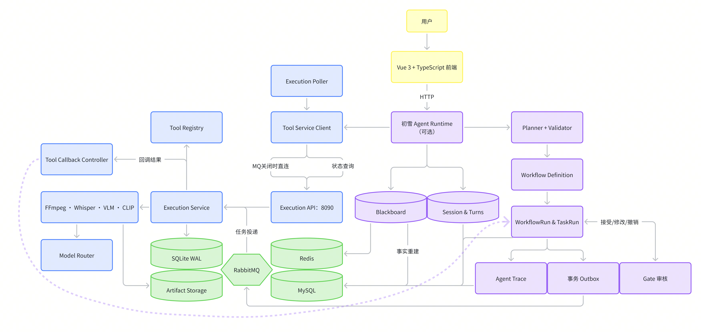

# 智能视频制作流水线：技术架构原理说明

> 本文面向需要真正理解项目设计的人，用于新人接手、面试复盘和架构评审。文档中的架构、组件和边界均以当前源码为准。
>
> 正式项目目录：`C:\Users\XRZ\Desktop\ninth\WwDa3B884n8dj`

---

## 1. 项目要解决什么问题

项目的输入不是固定按钮，而是一段自然语言描述：

```text
用户自然语言目标（"做一个45秒的快节奏视频，带字幕和BGM"）
+ 项目中的多份视频素材
+ 目标时长、字幕、BGM、风格、审核偏好
```

输出是一份可预览、可下载、可解释的成片，以及这次创作过程的完整可追溯状态。

### 1.1 为什么不能直接用 HTTP 调用 FFmpeg

如果只用一个同步接口调用 FFmpeg，起初能跑通，但很快会遇到工程问题：

- 一个项目有多个素材，任务之间有依赖，不是单步串行；
- VLM、Whisper、渲染耗时很长，不能占着 HTTP 线程不释放；
- Worker 进程可能崩溃，任务需要重试和恢复；
- 用户希望在镜头、故事、时间线或 BGM 阶段人工干预；
- AI 助手需要知道项目已经做到哪一步，不能只靠聊天历史猜测；
- LLM 不能获得任意 Shell 或工具执行权限；
- 用户切换窗口、刷新页面或重启服务后，状态必须可恢复。

### 1.2 核心设计原则

> LLM 负责"理解和建议"，Java 负责"验证和决定"，Python 负责"计算和产出"。

三个角色各司其职：LLM 只输出结构化的意图和建议，不控制任何工具；Java 控制面负责事务、调度、权限和状态机；Python 执行面负责 FFmpeg、模型推理和媒体计算。

---

## 2. 总体架构

### 2.1 架构图



### 2.2 纯文字总览

```text
                         浏览器
               Vue 3 + TypeScript + Pinia
          初雪 AI 对话 · Workflow Monitor · Gate 审核
                         │ REST / Cookie / CSRF
                         ▼
          ┌──────────────────────────────────┐
          │   Java 21 · Spring Boot 3.4      │
          │   Control Plane        :8080     │
          │                                  │
          │  [可选] 初雪 Agent（Session ·     │
          │      Blackboard · Planner · Gate）│
          │  Workflow 引擎（Definition → Run  │
          │      → Task · Execution · 并发锁）│
          │  Tool Client · Callback Controller│
          │  Auth · Storage Router · Outbox  │
          └──────────────────────────────────┘
       ┌──────────┼───────────────┬──────────────┐
       │          │               │              │
    MySQL 8   RabbitMQ 3.13    Redis 7     本地 Volume
   业务事实    Outbox → 队列     Blackboard    / 阿里云 OSS
   Projects   Task 分发         Gate 草稿     媒体二进制
   Workflows  Worker 消费      并发锁         Artifact
   Sessions                    限流           JSON / SRT
   Artifacts
   Trace · Gate Feedback
       │          │               │              │
       │          ▼               │              │
       │  ┌─────────────────────────────────┐    │
       │  │  Python 3.12 · FastAPI          │    │
       │  │  Tool Service         :8090     │    │
       │  │                                 │    │
       │  │  Execution Service（资源组调度） │    │
       │  │                                 │    │
       │  │FFmpeg / FFprobe（探测·代理·渲染）│    │
       │  │  Whisper（语音转写·字幕合成）     │    │
       │  │  VLM / CLIP（场景·物体·人物识别） │    │
       │  │  Model Router（LLM 路由与降级）  │    │
       │  │  Story Plan · Shot Ranking      │    │
       │  │  Timeline · BGM · Subtitle      │    │
       │  │                                 │    │
       │  │  SQLite WAL（执行日志·幂等·恢复） │    │
       │  │  Rabbit Worker（异步消费·回调）   │    │
       │  └─────────────────────────────────┘    │
       │          │                              │
       └──────────┴── Artifact 元数据与结果 ──────┘
```

### 2.3 请求路径

当 `RABBITMQ_ENABLED=true`（默认生产路径）：

```text
Control Plane
  → 业务事务提交（Task DISPATCHING + Outbox PENDING）
  → Outbox Publisher 读取 PENDING
  → 发布 RabbitMQ（Publisher Confirm）
  → 收到确认后标记 Outbox.PUBLISHED
  → Worker 消费消息 → 执行 Tool → HTTP 回调 Control Plane
```

当 `RABBITMQ_ENABLED=false`（HTTP 直连回退）：

```text
Control Plane
  → 业务事务提交（Task DISPATCHING）
  → WorkflowDispatchListener 直接调用 FastAPI Tool Execution API
  → Tool Execution Poller 轮询执行结果
```

两条路径最终都进入同一个 Python Execution Service，结果通过回调或轮询回到 Control Plane。

---

## 3. 为什么拆分 Control Plane 和 Tool Service

### 3.1 Control Plane：业务控制面（Java）

Java 负责长期存在、必须可靠的业务状态：

```text
用户与权限：
  User · Session · CSRF · 限流 · 项目所有权

Agent 层：
  初雪会话 · 对话轮次 · Blackboard · 意图解析 · 计划快照

Workflow 层：
  Definition · Run · Task · Dependency · Gate · 重试 · 恢复

Artifact 层：
  元数据 · 内容哈希 · 生产者血缘 · 版本管理

消息层：
  Outbox · RabbitMQ 拓扑 · 发布确认

观测层：
  Agent Trace · Prometheus 指标 · LLM 审计
```

### 3.2 Tool Service：执行数据面（Python）

Python 负责计算密集和媒体相关的工具：

```text
媒体处理：
  FFprobe 探测 · FFmpeg 代理转码 · 镜头检测 · 视频渲染

视觉分析：
  画质评分 · 场景分类 · 物体检测 · 人物检测 · VLM 语义分析

音频处理：
  Whisper 语音转写 · 源音频转录 · BGM 选择

智能决策：
  Story Plan（LLM + 确定性回退）· Shot Ranking · Highlight Selection
  Timeline 编译 · 字幕合成

执行管理：
  资源组线程池 · SQLite WAL 日志 · 幂等 · Rabbit Worker
```

拆分后，Java 不需要启动 Python 子进程，Python 也不能直接修改 Java 业务数据库。两者通过版本化 Tool API、HTTP 回调和 RabbitMQ 消息交互。

---

## 4. 动态 DAG 的原理

动态 DAG 是执行前的编排，不是运行中的热修改。

```text
用户在初雪聊天中描述创作目标
       │
       ▼
ChuxueIntentParser 从自然语言中提取：
  · 目标时长（"45秒" → 45000ms）
  · 字幕偏好（"要字幕"/"不要字幕"）
  · BGM 偏好（"来点音乐"）
  · 节奏偏好（"快节奏"/"慢节奏"/"均衡"）
  · 审核偏好（"中间审核" / "开启人工审核"）
  · 自动模式标记
       │
       ▼
Tool Service / LLM（仅在使用 LLM 时）：
  输出结构化工作流意图 JSON
  · 能力开关：字幕/BGM/VLM/转录
  · 目标时长毫秒数
  · 审核 Gate 列表
       │
       ▼
Java DynamicWorkflowPlanner：
  · 基于 MultiAssetAnalysisTemplate（13 节点 · 19 边 · 5 Gate）
  · 应用意图中的能力过滤（去除 disabled 的节点和 Gate）
  · 嵌入 ToolGovernanceCatalog 的治理元数据
  · 生成候选 WorkflowDefinition
       │
       ▼
WorkflowDefinitionValidator 校验：
  · 节点键格式 · 无重复 · 工具名在 Registry 中存在
  · 参数白名单 · 边引用有效 · 无自循环 · 无环
  · 工作流作用域节点不能馈送资产作用域节点
  · UPSTREAM_ARTIFACT 绑定节点至少有一条入边
       │
       ▼
用户确认计划 → 保存 AgentPlanSnapshot → 创建 WorkflowRun
       │
       ▼
DAG 拓扑冻结，展开为 TaskRun
```

**关键约束**：LLM 只能返回结构化能力意图（要不要字幕、要不要 BGM、目标时长），不允许返回 Shell 命令、FFmpeg 参数、SQL 语句、文件路径或任意工具调用。

### 4.1 默认模板的逻辑节点

```text
素材级节点（每个素材独立展开）：
  video.probe ─────────── 读取视频元数据
       │
  video.proxy-generate ── 生成低码率代理视频
       ├── video.shot-detect ────── 检测镜头切分点 + 提取关键帧
       ├── vision.quality-score ─── 画质评分 + 视觉指纹
       ├── vision.vlm-analyze ───── 场景/物体/人物语义识别
       └── audio.source-transcribe  源音频语音转写（可选）

工作流级节点（全局执行一次）：
  quality + VLM → decision.shot-rank ── 镜头质量排序与去重
       │
       ▼
  planning.story-template ── 五段式故事编排（HOOK/INTRO/JOURNEY/CLIMAX/ENDING）
       │
       ▼
  decision.highlight-select ── 高光选择与故事镜头配对
       │
       ▼
  timeline.compose ── 时间线编译（含转场、BGM 布局）
       ├── audio.bgm-select ─────── 背景音乐选择（可选）
       └── subtitle.compose ─────── 字幕合成（可选）
       │
       ▼
  video.render ── 最终视频渲染（BGM 和字幕为可选上游）
```

每个素材展开为独立的素材级 Task，之后汇聚到工作流级排序、故事和渲染 Task。13 个逻辑节点 ≠ 运行时只有 13 个 Task——实际 Task 数量随素材数增长。

---

## 5. Workflow、Task 和 Gate 的完整流程

### 5.1 Workflow 状态机

```text
                    ┌── 创建 Workflow ──→ RUNNING
                    │                      │
                    │          ┌───────────┤
                    │          │           │
                    │    到达 Gate    所有必需 Task 完成
                    │          │           │
                    │          ▼           ▼
                    │       PAUSED     SUCCEEDED
                    │          │
                    │    用户继续/自动模式
                    │          │
                    │          └──→ RUNNING
                    │
                    │     必需 Task 失败且重试耗尽
                    │          │
                    │          ▼
                    └──→ FAILED
```

### 5.2 Task 状态机

```text
PENDING ──→ READY ──→ DISPATCHING ──→ RUNNING
                           │              │
                           │         ┌────┴────┐
                           │         │         │
                           │    SUCCEEDED   FAILED
                           │                   │
                           │          RETRY_WAIT ──→ READY
                           │
                      (上游失败时)
                           │
                           ▼
                        SKIPPED
```

Task 只有在所有必需上游 Artifact 存在后才进入 READY。必需依赖失败会阻断下游；可选增强（BGM、字幕）失败可以安全降级——没有字幕和 BGM 仍可渲染纯视频。

### 5.3 Gate：人机协作暂停点

Gate 不是前端弹窗，也不是一个 Tool。它是 Workflow 状态机的一部分，持久化在 WorkflowRunEntity 中。

```text
Gate 触发流程：
  afterNode 的生产节点 SUCCEEDED
    → Workflow 进入 PAUSED
    → currentGateKey 设为对应的 gate key
    → 前端展示对应的审核界面

Gate 修改与继续：
  用户修改 Story Plan / Timeline / BGM 选择
    → 后端创建新的不可变 Artifact（不覆盖旧版）
    → 重置当前 Gate 产物的下游 Task
    → 不会重建无关的上游分析
    → Workflow 继续推进

Gate 取消：
  跳过未完成的 Task
    → Workflow 置为 FAILED
    → 清除 currentGateKey
    → 同步 Agent Session 和 Blackboard
    → 写入 WORKFLOW_CANCELLED Trace
```

5 个默认 Gate：

| Gate Key | 触发节点 | 用户操作 |
| --- | --- | --- |
| gate_shot_ranking | shot_ranking | 调整评分、强制入选/排除镜头 |
| gate_story_edit | story_plan | 编辑五段式故事安排、版本管理 |
| gate_timeline_preview | timeline_compose | 预览时间线、调整转场和片段顺序 |
| gate_bgm_review | bgm_select | 试听和选择 BGM 候选 |
| gate_render_review | video_render | 预览最终成片 |

自动模式跳过人工暂停，但结构化校验和确定性编译不变。

---

## 6. RabbitMQ 与 Transactional Outbox

### 6.1 为什么需要 Outbox

如果 Java 先更新 Task，再直接发送 RabbitMQ 消息，可能在两步之间崩溃：数据库显示 Task 已准备执行，但消息队列中没有这条记录。Outbox 解决这个双写问题：

```text
同一个 MySQL 事务内：
  · Task 状态 → DISPATCHING
  · 固化 attempt / idempotencyKey / dispatch token
  · OutboxMessage 状态 → PENDING

事务提交后（Outbox Publisher 独立线程）：
  · 读取 PENDING 消息
  · 发布到 RabbitMQ（Publisher Confirm，5 秒超时）
  · 成功：标记 PUBLISHED
  · 失败：记录 attempts / nextAttemptAt / lastError（指数回退重试）
```

### 6.2 RabbitMQ 拓扑

```text
avp.task.v1（Topic Exchange，持久化）
  task.light.requested  → avp.task.light.v1   → 死信交换机 avp.dead.v1
  task.media.requested  → avp.task.media.v1   →       │
  task.model.requested  → avp.task.model.v1   →  avp.task.dead.v1
  task.render.requested → avp.task.render.v1  →

死信队列：
  avp.dead.v1 交换机 → avp.task.dead.v1 队列
```

每条消息按资源组（LIGHT/MEDIA/MODEL/RENDER）路由到不同队列，让不同资源需求的工具分配到不同 Worker 组。

### 6.3 消费与回调

```text
Rabbit Worker 消费流程：
  1. 从队列接收消息
  2. 持久化执行记录（CLAIM_PENDING）
  3. 向 Control Plane claim（HTTP 内部接口 + Worker Token）
  4. claim 成功后 dispatch → Execution Service 调度执行
  5. 将 OSS 输入物化到本地
  6. 执行 Tool
  7. 上传输出
  8. HTTP 回调 Control Plane（/internal/tool-callbacks）
  9. Rabbit 消息 ACK
```

Python Worker 完成工具调用后，通过 HTTP 回调 Java Control Plane 回传结果，不走 RabbitMQ 回传。重复消息依靠幂等键和 Attempt 收敛。

---

## 7. Worker 横向扩展与资源组

同一 Tool Service 镜像可以按资源组启动独立 Worker：

```text
资源组分类：
  LIGHT    │ 排序、故事规划、轻量编排 │ CPU 轻量，可多副本
  MEDIA    │ Probe、代理视频、镜头切分 │ 磁盘/CPU 密集
  MODEL    │ VLM、Whisper、语义分析   │ 内存/GPU 敏感，低并发
  RENDER   │ FFmpeg 最终渲染          │ 重资源，严格限流
```

```text
并发控制三层：
  项目级 Workflow 准入（Redis 锁或 MySQL 查询）
     → Java Task 调度
     → RabbitMQ prefetch（未确认消息数）
     → Python 资源组槽位（LIGHT=4, MEDIA=3, MODEL=2, RENDER=2）
     → 重任务总上限 HEAVY=4
     → 外部 FFmpeg / 模型进程
```

`prefetch` 只控制未 ACK 消息数量，不等于执行线程数。需要提高吞吐时优先增加 Worker 副本数或调整槽位，而不是盲目调大 prefetch。

---

## 8. Redis 的定位

Redis 不是业务真相，不保存视频或最终 Artifact。它用于低延迟、可丢失的可重建数据：

```text
Redis 的四种用途：
  1. Blackboard JSON 快照 —— 减少每轮 Agent 对 MySQL 的重复聚合
  2. Gate 草稿 + revision —— 用户编辑时间线/故事时保存临时版本
  3. Workflow/Session 锁 —— 防止并发冲突
  4. 认证限流 —— 登录/注册频率控制
```

```text
Redis 关闭后的行为：
  · Blackboard → 每次从 MySQL 重新聚合（性能下降但结果正确）
  · 草稿 → 回退到进程内 ConcurrentHashMap
  · 锁 → 回退到数据库悲观锁
  · 限流 → 回退到内存滑动窗口
  · Workflow、Task、Artifact 完全不受影响
```

所有 Redis Key 带版本前缀（如 `avp:v1:`），所有快照必须可重建——`BlackboardService.refresh()` 从 MySQL 重新聚合事实后更新 Redis。

---

## 9. Artifact：任务间的核心边界

Artifact 让任务之间传递"已落盘、有 ID、有哈希的结果"，而不是传递内存对象。

```text
Artifact 数据流（视频分析管道示例）：
  VIDEO_METADATA → SHOT_LIST → QUALITY_SCORES + SCENE_TAGS
                                          │
                                          ▼
                                    SHOT_RANKING
                                          │
                                    STORY_PLAN
                                          │
                                    TIMELINE
                                    │      │
                               BGM_AUDIO  SUBTITLE_SRT
                                    │      │
                                    ▼      ▼
                               RENDERED_VIDEO
```

```text
Artifact 的设计原则：
  1. 数据库只保存元数据（type、producer_task_run_id、storage_uri、content_hash）
  2. 视频/音频/图片 → OSS 或本地共享卷
  3. JSON/SRT → 文件存储，小体量也可放在 metadataJson LONGTEXT
  4. 编辑或重试产生新 Artifact（新 contentHash），不覆盖旧对象
  5. Task 可以重试而不依赖上一个进程的内存
  6. Gate 可以编辑结构化 Artifact 后产生新版本
  7. Agent 可以读取摘要并解释决策
```

---

## 10. LLM 的安全边界

LLM 只做"建议"，不做"执行"：

```text
LLM 调用全链路：
  用户消息
    → Blackboard（项目事实：素材摘要、Workflow 状态）
    → 结构化 Prompt（系统身份、能力边界、约束规则）
    → Model Router 路由（DeepSeek/OpenAI/Claude）
    → LLM 返回结构化 JSON
    → JSON 提取（Markdown fence 清理）
    → JSON Schema 校验
    → 业务校验（时长范围、Gate 白名单、shouldPlan 条件）
    → 确定性编译（Java Planner + Validator）
    → Python Registration 白名单执行
```

```text
LLM 不允许做的事情：
  · 生成 Shell 命令或 FFmpeg 参数
  · 构造文件路径
  · 选择工具名或版本号
  · 决定任务调度顺序
  · 伪造 system 角色消息

LLM 失败处理：
  · LLM 不可用 → Model Router 返回不可用状态
  · VLM 不可用 → 路由到 CLIP-local，记录 VLM_UNAVAILABLE
  · Story Plan LLM 失败 → 确定性回退算法
  · 返回非法 JSON → 最多 2 次重试，仍失败则使用默认值
```

---

## 11. 初雪 Agent 的完整决策链

### 11.1 LangGraph 决策图

初雪 Agent 使用 LangGraph 0.6 作为有限推理循环，不用于替代 Java Workflow：

```text
LangGraph 节点流程：
  prepare_context ── 复制请求上下文，建立图状态
       │
  merge_constraints ── 从最新消息提取时长/字幕/BGM 等高置信约束
       │
  classify_request ── 区分 CHAT / PLAN / CLARIFICATION / ACTIVE_WORKFLOW_STATUS
       │
  decide ── 调用受控的 Java 决策函数 / Tool Service LLM
       │
  validate_proposal ── 检查 shouldPlan / planningGoal / 时长和活跃 Workflow 边界
       │
  finalize ── 注入 graphStages 和 runtime 标记
```

LangGraph 的输出仍必须回到 Java 校验，不会绕过业务控制面。

### 11.2 三种对话模式

```text
普通聊天（CHAT）：
  用户消息 → 写入 USER Turn → refresh Blackboard
    → 发送最近历史 + 项目事实给 LLM
    → 校验 reply / shouldPlan
    → 写入 ASSISTANT Turn → 返回前端
  （不会创建 Plan，不会启动 Workflow）

计划请求（PLAN）：
  用户消息 → 提取时长/字幕/BGM/审核约束
    → LLM 生成结构化意图（或确定性提取）
    → Java 合并 Session 和 Blackboard
    → DynamicWorkflowPlanner 生成候选 Definition
    → Validator 校验 DAG
    → 保存 AgentPlanSnapshot
    → 前端展示"确认计划"卡片
  （只创建待确认的 Plan，不启动 Worker）

目标修改（ACTIVE_WORKFLOW）：
  用户说"改成 15 秒""不要字幕" → 最新消息优先于历史猜测
    若当前 Workflow 正在执行：
      → Agent 解释当前状态，拒绝创建第二个 Workflow
    若当前 Workflow 已终态：
      → 允许基于当前 Session 重新规划
```

---

## 12. Blackboard、RAG 与上下文管理

### 12.1 Blackboard：Agent 的项目事实视图

Blackboard 把分散在 MySQL 的素材、Artifact、Workflow、Gate、Trace 聚合成统一视图，限制发送给 LLM 的数据量：

```text
Blackboard 重建过程：
  MySQL（事实来源）
    ├── AgentSession · Turns    → sessionState + 对话历史摘要
    ├── AssetEntity             → assets（文件名、时长、分辨率摘要）
    ├── WorkflowRun · TaskRun   → workflowStatus + taskProgress
    ├── ArtifactEntity          → videoMetadata · shotList · semanticTags
    ├── AgentTraceEvent         → traceEvents（关键事件摘要）
    └── BGM 推荐               → bgmCandidates
       │
       ▼
  BlackboardView（聚合视图）
       │
       ▼
  Redis 缓存（可重建快照，减少重复聚合）
```

### 12.2 项目内 RAG

`retrieve_story_evidence()` 是确定性混合检索——根据叙事角色对候选镜头打分：

```text
HOOK / INTRO / JOURNEY / CLIMAX / ENDING
       │ (按角色查询术语)
       ▼
候选 Shot + 质量分 + 语义标签 + 转写片段
       │ (加权打分)
       ▼
语义标签重叠（55%）+ 画质分（25%）+ 运动兴趣（15%）+ 时间顺序（5%）
       │
       ▼
Story Plan / Highlight Selection 的证据输入
```

每个候选都有 Shot ID、来源素材和可解释的证据摘要，不需要外部向量数据库或标注数据。

---

## 13. 存储设计总览

### 13.1 MySQL 保存什么

```text
业务事实（不可丢失）：
  users · auth_sessions ────── 用户与登录
  projects · assets ─────────── 项目与原始素材
  agent_sessions · turns · plan_snapshots ── Agent 会话与计划
  workflow_runs · tasks · dependencies ──── Workflow 执行状态
  tool_executions ───────────── Java Task ↔ Python execution 映射
  artifacts ─────────────────── 不可变产物元数据 + 内容哈希
  outbox_messages ──────────── 事务消息发布状态
  agent_trace_events ───────── 业务审计事件
  gate_feedback · custom_story_plans ── Gate 反馈与版本历史
```

Flyway 按 `V1__` 到 `V7__` 顺序执行 SQL 迁移，确保数据库结构与代码同步演进。

### 13.2 Redis 保存什么

```text
可重建、可丢失的临时数据：
  Blackboard Snapshot ── 减少 MySQL 重复聚合
  Gate 草稿 + revision ── 编辑冲突检测
  Workflow 锁 ── 并发控制
  认证限流 ── 频率控制
```

### 13.3 文件存储保存什么

```text
媒体文件（OSS 或本地共享卷）：
  原始上传文件 · 代理视频 · 关键帧 · BGM · 字幕文件 · 最终渲染视频
结构化文件（本地）：
  JSON Artifact · SRT 字幕 · Manifest
```

数据库不保存视频二进制，只保存可定位和可校验的元数据（`storage_uri` + `content_hash` + `media_type` + `size_bytes`）。

---

## 14. 认证与安全

```text
请求认证流程：
  浏览器 → Cookie（avp_session, HttpOnly）
    → AuthenticationInterceptor 拦截 /api/v1/**
    → 从 Cookie 读取令牌，SHA-256 哈希
    → 查询 auth_sessions 表
    → 检查过期、撤销
    → 将 CurrentUser 写入请求属性
    → ProjectService.getRequiredForUser 检查资源所有权

写请求保护：
  浏览器 → Cookie（avp_csrf, Lax SameSite）
    → CsrfProtectionInterceptor 拦截非 GET/HEAD/OPTIONS
    → 比较 Cookie 中的令牌与 X-CSRF-Token 请求头
    → 不匹配 → 403

内部接口保护：
  /internal/tool-callbacks     → Worker HTTP 回调
  /internal/tool-claims        → Worker claim + X-Internal-Worker-Token 验证
```

密码使用 BCrypt（成本因子 12）哈希存储，会话令牌为 256 位随机数，只在数据库保存 SHA-256 哈希值。

---

## 15. 可观测性

```text
指标层（回答"系统是否健康"）：
  Actuator → 健康检查 /actuator/health
  Micrometer → Workflow 成功率、Task 耗时
  Prometheus → 模型路由调用数、延迟、Token 用量
  Outbox → PENDING 数量、发布延迟

追踪层（回答"这一次为什么这样做"）：
  Agent Trace → 连接 Session → Plan → Workflow → Task → Model → Artifact
  事件类型包括：
    CHUXUE_PLAN_PROPOSED · TASK_DISPATCH_PREPARED · TOOL_CLAIMED
    TOOL_COMPLETED · TOOL_FAILED · GATE_PAUSED · WORKFLOW_CANCELLED
  ChuxueExplanationService → 将事件编译为用户可读的中文解释
```

---

## 16. 数据一致性与故障恢复

### 16.1 各存储的恢复策略

```text
MySQL 故障：
  → 所有业务状态丢失（灾难级别）
  → 需要数据库备份和主从复制（当前为单机学习环境）

RabbitMQ 故障：
  → 关闭 RABBITMQ_ENABLED，切回 HTTP dispatch 路径
  → Outbox 保留未发布消息，恢复后继续投递
  → 未确认消息在 Worker 恢复后重新投递

Redis 故障：
  → 关闭 REDIS_ENABLED，使用数据库/内存回退
  → Blackboard 每次从 MySQL 重建
  → 草稿回退到 ConcurrentHashMap
  → 锁回退到数据库悲观锁

Worker 崩溃：
  → 未确认消息重回 Rabbit 队列
  → 旧 Attempt 的迟到结果因 Token 不匹配被拒绝
  → Execution Store（SQLite WAL）保留执行记录供恢复

用户刷新或切换页面：
  → 前端重新读取 Session Turns、Runtime 和当前 Gate
  → 后端以 MySQL 为准，不依赖浏览器内存
```

### 16.2 Python 执行面恢复

```text
ExecutionService 启动时：
  1. 从 SQLite WAL 读取 QUEUED/RUNNING 状态的执行记录
  2. 重新提交到资源组线程池
  3. 已完成的记录回调控制面确认状态
  4. 无法恢复的标记为 FAILED（exhausted recovery count）
```

---

## 17. Task 到 Artifact 的完整示例

以 `video.shot-detect` 为例说明一个镜头是如何产生的：

```text
1. 用户上传原视频 → AssetEntity 保存 source storage_uri
       │
2. video.probe → 读取视频时长、分辨率、音轨信息 → VIDEO_METADATA Artifact
       │
3. video.proxy-generate → 生成低码率 H.264 代理视频 → VIDEO_PROXY Artifact
       │
4. video.shot-detect 进入 READY（上游 VIDEO_PROXY 已成为 Artifact）
       │
5. Control Plane 准备 Tool Execution Request：
     tool: "video.shot-detect", version: "1.0.0"
     input: VIDEO_PROXY artifactId + storageUri
     parameters: { sceneThreshold: 0.30, minShotDurationMs: 600 }
       │
6. Dispatch → RabbitMQ 或 HTTP → Worker 接收
       │
7. Worker 物化输入（从 OSS 或共享卷下载代理视频到本地）
       │
8. FFmpeg 执行场景检测滤镜，计算镜头边界
       │
9. 每个镜头截取中位关键帧 → KEYFRAME_IMAGE Artifact
       │
10. 生成 SHOT_LIST JSON → 上传或写入存储
       │
11. Worker HTTP 回调 Control Plane → SUCCEEDED
       │
12. Java 保存 ArtifactEntity（type=SHOT_LIST, content_hash, storage_uri）
       │
13. 下游 Task（vision.quality-score、vision.vlm-analyze）→ READY
       │
14. 前端根据 Artifact 元数据和 JSON 内容展示镜头卡片
```

注意：前端看到的镜头卡片不是独立数据库表，而是根据 Artifact 元数据和 JSON 内容装配出来的业务视图。

---

## 18. 端到端数据流图

### 18.1 素材上传

```text
浏览器选择文件 → FormData → POST /api/v1/projects/{id}/assets
  → ProjectController → 权限校验 → AssetService
  → ArtifactStorage.store（OSS 或本地）
  → AssetEntity 保存元数据
  → 返回 contentUrl（OSS 预签名 URL 或本地直链）
  → 浏览器预览
```

### 18.2 一次创作请求的完整时序

```text
用户描述需求 → Vue + ChuxueChatCard
  → POST /projects/{id}/chuxue/chat
  → Java: 写入 User Turn → refresh Blackboard
  → LLM: 结构化聊天决策
  → Java: 写入 Assistant Turn → 返回自然回复或计划建议

用户发起计划 → POST /chuxue/plan
  → Intent → DynamicWorkflowPlanner → 受控 Workflow Definition
  → 保存 AgentPlanSnapshot
  → 前端展示计划确认卡

用户确认 → POST /chuxue/plans/{id}/confirm
  → 验证计划 → 创建 WorkflowRun → expandTasks → 保存 Dependency
  → evaluateWorkflow → 找到 READY Task
  → prepare Dispatch → Outbox PENDING → RabbitMQ 发布

Worker 消费 → 物化输入 → 执行 Tool → 上传输出
  → HTTP 回调 → Java applyToolResult
  → 创建 Artifact → 传播依赖 → 下游 Task READY
  → 持续 evaluate → 到达 Gate → PAUSED

用户操作 Gate → 前端提交编辑 → 后端创建新 Artifact
  → 重置下游 Task → 继续 Workflow
  → 最终 video.render 完成 → Workflow SUCCEEDED
  → 返回最终视频 URL
```

### 18.3 审计页面数据流

```text
审计页面 → GET /api/v1/llm-audits
  → Redis 缓存命中? → 返回分页摘要
  → 缓存未命中 → MySQL 批量查 Workflow/Task/Artifact
  → 从 Artifact 读取 Story Plan JSON 中的 llmAudit 字段
  → 后端聚合 Provider/Model/Latency/Token/Result
  → 写 Redis TTL 缓存 → 返回
```

---

## 19. Java 部分：四层架构

```text
HTTP Controller
    ↓ 参数校验、登录校验、资源归属校验
Application Service
    ↓ 创建 Workflow、推进 Task、处理 Gate、应用结果
Domain Entity / State Machine
    ↓ WorkflowRun、TaskRun、Artifact、Outbox
Repository / Infrastructure
    ↓ JPA、MySQL、RabbitMQ、Redis、OSS
```

### 19.1 核心类职责

```text
WorkflowExecutionService（最核心的类，~1742 行）：
  · createWorkflow —— 创建工作流实例，展开节点为 Task
  · evaluateWorkflow —— 拓扑遍历：找 READY Task、检查 Gate、处理终态
  · prepareDispatch —— 构建 Tool Execution Request
  · applyToolResult —— 接收回调，更新状态，创建 Artifact，传播依赖
  · 恢复 —— 处理死信分派和 RETRY_WAIT 超时

WorkflowDispatchListener（@Async + @TransactionalEventListener）：
  · Rabbit 模式 → RabbitDispatchService → Outbox PENDING
  · HTTP 模式 → ToolServiceClient.createExecution（直连 FastAPI）

WorkflowAdvanceCoordinator：
  · 在推进操作前获取 Redis 锁
  · Redis 不可用时回退到数据库悲观锁

AgentSessionService：
  · 会话生命周期管理
  · 黑名单缓存清理
  · 工作流状态同步
```

### 19.2 典型事务边界

```text
@Transactional
  1. 读取并锁定 Workflow（悲观写锁）
  2. 读取并锁定 Task
  3. 更新 Task 状态
  4. 写入 ToolExecution / Artifact / Outbox
  5. 评估 Workflow（evaluateWorkflow）
  6. 同步 Agent Session
提交事务

事务提交后（AFTER_COMMIT）：
  · Rabbit 模式 → Outbox Publisher 异步发布
  · HTTP 模式 → WorkflowDispatchListener 直连 Tool Service
```

---

## 20. Python 部分：受控工具运行时

```text
执行入口：
  Control Plane → HTTP submit / Rabbit message → FastAPI / Rabbit Worker
    → Pydantic Request 校验
    → Tool Registry 查找（name + version）
    → ExecutionStore 幂等登记
    → 资源组线程池调度
    → 具体 Tool 实现
    → Artifact 输出
    → Callback Control Plane
```

### 20.1 Tool Registry

Registry 是 Python 侧的能力白名单，当前注册 17 个工具：

```text
Tool(name, version) → manifest()
  ├── 输入 Artifact 类型
  ├── 输出 Artifact 类型
  ├── 参数 Schema
  ├── 资源组（LIGHT / MEDIA / MODEL / RENDER）
  ├── 自动化策略（AUTO / REQUIRE_CONFIRMATION）
  ├── 最大 Attempt · 超时秒数 · 是否可降级
  └── execute(request, report_progress)
```

Java 的 `toolName`、`toolVersion`、输入类型必须与 Python Registry 保持一致，否则出现"DAG 校验通过但执行时找不到工具"的跨服务契约错误。

### 20.2 ExecutionStore（SQLite WAL）

```text
SQLite 表结构：
  tool_executions ── execution_id · idempotency_key · status · 完整请求 JSON
  callback_outbox  ── 回调负载 · 状态 · 计划发送时间

作用：
  · 幂等去重
  · 进程重启后恢复 QUEUED/RUNNING 的执行
  · 回调失败后重试（指数回退）
```

### 20.3 资源组并发与模型释放

```text
资源组并发模型：
  LIGHT    │ ThreadPool (max=4)     │ 故事规划、排序等轻量编排
  MEDIA    │ ThreadPool (max=3)     │ Probe、代理、镜头切分
  MODEL    │ ThreadPool (max=2)     │ VLM、Whisper、语义分析
  RENDER   │ ThreadPool (max=2)     │ FFmpeg 渲染
  HEAVY    │ 全局上限 = 4           │ MODEL + RENDER 共享
```

```text
MODEL 工具执行完成后：
  → release_models()
  → 卸载 CLIP/Whisper 模型引用
  → gc.collect() + malloc_trim()
  → 归还本地堆内存给容器
```

---

## 21. API 接口分类

```text
用户接口（/api/v1/*）：
  /api/v1/auth/*          —— 注册、登录、登出、当前用户
  /api/v1/projects/*      —— 项目 CRUD、素材上传与管理
  /api/v1/workflow-runs/* —— Workflow 启动、查询、继续、取消
  /api/v1/agent-sessions/*—— 初雪会话与对话轮次
  /api/v1/agent-traces/*  —— Agent Trace 与解释
  /api/v1/artifacts/*     —— Artifact 内容访问
  /api/v1/llm-audits      —— LLM 审计聚合
  /api/v1/dag-drafts/*    —— DAG 画布草稿
  /api/v1/bgm-selection/* —— BGM 选择与上传

Chuxue Agent 接口（/api/v1/projects/{id}/chuxue）：
  /chat  —— 对话
  /plan  —— 制定计划
  /plans/{id}/confirm —— 确认计划

Chuxue Gate 接口（/api/v1/workflow-runs/{id}/chuxue-gate）：
  GET    —— 获取当前 Gate 视图
  POST   —— 提交 Gate 决策

内部接口（/internal/*，仅供 Worker 访问）：
  /internal/tool-callbacks  —— Worker 结果回调
  /internal/tool-claims     —— Worker 任务认领
```

---

## 22. 前端架构

```text
前端组件分层：
  router/ ── 路由配置 + 认证守卫
  stores/ ── Pinia 状态（auth · project · workflow · review · chuxue · ui）
  api/    ── HTTP 客户端封装（fetch + Cookie + CSRF）
  shared/ ── 领域类型 + 常量 + composables（usePolling、useVideoPlayer）
  components/ ── AppShell · ChuxuePet · ChuxueChatCard · TaskGrid · ShotPreviewPanel
  features/ ──
    auth/      AuthPage（登录/注册）
    projects/  ProjectListPage · ProjectDetailPage
    assets/    AssetUpload · AssetList
    workflow/  WorkflowTopologyPlanner（DAG 画布）· WorkflowMonitorPage · WorkflowHistoryPage
    review/    ShotGalleryView · ShotRankingReview · StoryEditor · TimelinePreview
               BgmSelectionReview · FinalReview
    versions/  VersionList · VersionDiff · VersionListPage
    audit/     LlmAuditPanel
```

### 22.1 Chuxue 聊天内嵌 Gate

```text
ChuxueChatCard 组件：
  · 左侧：会话列表
  · 右侧：聊天面板（支持 message card、workflow status card、plan confirm card）
  · 工作流因 Gate 暂停时 → 嵌入 WorkflowMonitorPage（复用而非重写 Gate 组件）
  · 通过相同的 workflowRunId 读取相同的 Gate 状态
```

---

## 23. 测试策略

### 23.1 Java 测试（25 个测试类，83 个测试方法）

```text
核心覆盖：
  WorkflowDefinitionValidator ── 节点、边、Gate、环检测、可选依赖
  DynamicWorkflowPlanner     ── 能力过滤、审核 Gate、中英文意图
  WorkflowExecutionService   ── Task 状态机、依赖传播、Gate、BGM 选择
  TaskRunEntity              ── 正常流程、重试、跳过、消息截断
  AuthService / CsrfService  ── 注册、登录、会话、CSRF
  StoryPlanPayloadValidator  ── 五段式结构、镜头唯一性
  TimelinePayloadValidator   ── 片段、转场、间隙检测
  ChuxueIntentParser         ── 中文时长/BGM/字幕解析
```

### 23.2 Python 测试（23 个测试文件，124 个测试方法）

```text
核心覆盖：
  test_workflow_manifest  ── 13 个工具注册 + 跨服务契约一致性
  test_shot_decisions     ── 排序、故事编译、高光、RAG、LLM 提案校验
  test_video_render       ── 滤镜图构建、BGM 混音、字幕烧录、转场
  test_execution_persistence ── 幂等、恢复、回调外送
  test_chuxue_chat_json   ── JSON 解析、质量守卫、注入防御
  test_tool_governance    ── 治理字段完整性、确认要求
  test_resource_scheduler ── 资源组并发限制
```

---

## 24. 前端新人阅读方法

```text
页面到 API 的追踪方法：
  Vue 页面 → features 组件状态 → src/api/*.ts → src/api/client.ts
    → fetch + Cookie/CSRF → Java Controller

动态 DAG 画布（WorkflowTopologyPlanner.vue）新人应优先找：
  1. 节点数组从哪里来（LLM 意图 → Planner → 候选 Definition）
  2. 边数组从哪里来
  3. 拖拽时如何转换画布坐标
  4. 连接点如何生成 Edge
  5. 保存草稿的时机和 API
  6. 确认时调用哪个后端校验接口
  7. 后端失败后如何恢复画布状态
```

---

## 25. 学习路线的推荐顺序

### 25.1 代码阅读顺序

```text
第一步：理解核心契约
  1. workflow/WorkflowDefinition.java     —— 节点、边、Gate、输入绑定
  2. workflow/MultiAssetAnalysisTemplate.java —— 13 节点 19 边的默认管道

第二步：理解执行引擎
  3. execution/WorkflowRunEntity.java     —— Workflow 状态机
  4. execution/TaskRunEntity.java         —— Task 状态机和重试逻辑
  5. execution/WorkflowExecutionService.java —— 核心编排逻辑

第三步：理解消息与回调
  6. execution/WorkflowDispatchListener.java —— HTTP vs Rabbit 双路径
  7. outbox/OutboxService.java           —— 事务消息发布
  8. outbox/RabbitTopologyConfiguration.java —— 队列拓扑

第四步：理解工具契约
  9. toolclient/ToolServiceClient.java    —— Java → Python 调用契约
  10. tool-service/app/registry/          —— Python 工具注册
  11. tool-service/app/tools/             —— 具体工具实现

第五步：理解存储
  12. storage/ArtifactStorageRouter.java  —— Local/OSS 路由
  13. tool-service/app/execution/store.py —— SQLite 执行日志
```

### 25.2 推荐实验（不需要从头读全部代码）

```text
1. 关闭 RabbitMQ：设置 RABBITMQ_ENABLED=false，观察 HTTP 回退路径
2. 关闭 Redis：设置 REDIS_ENABLED=false，观察草稿/缓存回退
3. 模拟重复消息：向同一队列发送相同 idempotencyKey
4. 模拟 Worker 崩溃：在 ACK 前停止 Worker，观察重新投递
5. 删除可选 Artifact：观察字幕/BGM 降级行为
6. 删除必需 Artifact：观察下游 Task 阻断
7. 编辑 Story Plan：比较新旧 Artifact 的 contentHash
8. 查看 RabbitMQ 管理台：观察队列、消费者、DLQ
9. 上传两个视频：对照前端逻辑节点和数据库实际 Task 数量
10. 查看 Actuator/Prometheus：观察 Workflow Counter 与 Task Timer
```

---

## 26. 系统边界：某个需求应该改哪里

```text
新需求判断流程：
  新需求
    ├── 改变业务规则或最终状态？ → Java Control Plane + MySQL
    ├── 需要媒体/模型/FFmpeg 计算？ → Python Tool Service
    ├── 只是临时可重建数据？ → Redis
    ├── 是媒体对象？ → OSS / Artifact Storage
    └── 只是用户交互？ → Vue 前端
```

```text
常见陷阱：
  · 不在 Java Controller 中拼 HTML
  · 不让前端直接访问 MySQL
  · 不在 Java 中启动 FFmpeg 子进程
  · 不把大文件塞进 RabbitMQ 消息
  · 不把最终状态只放在 Redis
  · 不把视频二进制写入 MySQL
  · 修改 Tool 输入输出时，必须同时更新 contracts/ 和 Java 映射
```

---

## 27. 术语表

| 术语 | 含义 |
| --- | --- |
| DAG | 有向无环图，表示 Task 的依赖顺序 |
| Workflow Definition | 逻辑层的节点、边、工具版本和 Gate 定义 |
| TaskRun | Definition 展开后的实际任务实例 |
| Artifact | 不可变的 Task 输出和生产血缘记录 |
| Gate | 用户审核或业务暂停点（持久化在 WorkflowRun 中） |
| Attempt | Task 的执行尝试编号 |
| Idempotency Key | 识别同一次逻辑执行的稳定键 |
| Dispatch Token | 防止旧 Worker 结果覆盖新 Attempt |
| Outbox | 与业务事务一起写入、异步发布的消息记录 |
| Publisher Confirm | RabbitMQ 确认 Broker 已接收发布消息 |
| ACK | Worker 确认消费完成 |
| DLQ | Dead Letter Queue，处理无法消费的消息 |
| Materialize | 将 OSS Artifact 下载为 Worker 本地文件 |
| Manifest | Tool 的 name、version、输入、输出和参数契约 |
| Blackboard | Agent 的聚合项目事实视图 |
| Chuxue | "初雪"——项目的 AI 助手 |
| RAG | 项目内确定性镜头证据检索 |
| TTL | 缓存自动过期时间 |

---

## 28. 一句话总结

这个项目的核心不是"调用了多少 AI 模型"，而是把复杂的视频生产过程建模成有版本、有依赖、有人工 Gate、有幂等恢复能力的 Workflow：LLM 负责提出受约束的建议，Java 负责决定和记录，Python Worker 负责执行，RabbitMQ 负责可靠投递，Redis 负责加速，OSS 负责保存媒体，MySQL 负责最终真相。

如果能够沿着"用户 → 前端 → Control Plane → Task → MQ/HTTP → Worker → Artifact → 下游 Task"的链路定位问题，就已经掌握了这个项目的核心架构。
