# Agent-Driven 智能视频制作流水线：技术架构原理说明

> 本文用于学习和答辩后的架构复盘，说明当前正式项目的真实实现边界。正式项目目录为 `C:\Users\XRZ\Desktop\ninth\WwDa3B884n8dj`。

## 1. 项目要解决什么问题

项目把“上传多段视频并生成成片”拆成一个可恢复、可审核、可编辑的 DAG Workflow。用户可以：

1. 创建项目并上传多个视频、音频或图片素材；
2. 在执行前用自然语言描述目标时长和成片要求；
3. 由 LLM 生成候选能力组合，再由 Java Planner 生成受控 DAG；
4. 在中文流程图中拖拽节点、手动连线、删除节点或恢复默认 DAG；
5. 选择半自动或全自动执行模式；
6. 在镜头排序、故事计划、时间线、BGM 和最终成片等 Gate 进行人工审核；
7. 获得可追溯的 Artifact、执行记录、错误信息和 LLM 审计记录。

项目不是让 LLM 直接操作服务器，而是让 LLM 提供受约束的意图，让确定性的后端负责校验、编译和执行。

## 2. 总体架构

```text
                         浏览器
               Vue 3 + TypeScript + Pinia
                         │ REST / Cookie / CSRF
                         ▼
                 Java 21 Spring Boot
                  Control Plane
      ┌──────────────┼───────────────┬───────────────┐
      │              │               │               │
   MySQL        RabbitMQ          Redis            OSS
业务真相       Task 消息          草稿/缓存        媒体二进制
      │              │               │               │
      │              ▼               │               │
      │       Python Tool Workers ◄──┘               │
      │  FastAPI / FFmpeg / VLM / Whisper            │
      │              │                               │
      └──────────────┴──── Artifact 元数据/结果 ─────┘
```

部署方式是 Docker Compose。Caddy/反向代理可以统一暴露前端和 API；当前开发环境由 Control Plane 直接提供构建后的 Vue 静态文件。

## 3. 为什么拆分 Control Plane 和 Tool Service

### 3.1 Control Plane：业务控制面

Java 服务负责长期存在、必须可靠的业务状态：

- 用户、Session、项目和素材权限；
- Workflow Definition、DAG、Gate 和 Workflow 状态；
- Task、依赖关系、Attempt、重试和恢复；
- ToolExecution 与外部执行 ID 的映射；
- Artifact 元数据和不可变版本；
- Outbox 消息和 RabbitMQ 发布状态；
- REST API、审计和指标。

### 3.2 Tool Service：执行数据面

Python 服务负责计算密集或媒体相关的工具：

- FFprobe/FFmpeg 媒体处理；
- 镜头切分、代理视频生成和关键帧处理；
- 质量评分、场景/物体/人物分析；
- Whisper 源音频转写；
- BGM 搜索与下载；
- Timeline、字幕和最终渲染；
- 可选 DeepSeek/OpenAI/Claude 等模型调用。

拆分后，Java 不需要启动 Python 子进程，Python 也不能直接修改 Java 业务数据库。两者通过版本化 Tool API、回调和 RabbitMQ 消息交互。

## 4. 动态 DAG 的原理

动态 DAG 是执行前的 Gate，不是运行中的 Replan。

```text
自然语言需求
   ↓
Tool Service / LLM：输出受约束 Workflow Intent
   ↓
Java DynamicWorkflowPlanner：基于默认模板生成候选 Definition
   ↓
前端拓扑画布：用户拖拽节点、连线、删除或恢复默认 DAG
   ↓
Java WorkflowDefinitionValidator：校验节点、工具、输入绑定、依赖和环
   ↓
确认 DAG + 选择半自动/全自动
   ↓
创建 Workflow，拓扑冻结
```

LLM 只能返回结构化能力意图，例如是否需要 VLM、源转写、字幕或 BGM，以及目标时长。LLM 不允许返回 Shell、FFmpeg 命令、SQL、文件路径或任意工具调用。

当前多素材模板的逻辑节点包括：

```text
video.probe → video.proxy-generate → video.shot-detect
                                  ├→ vision.quality-score
                                  ├→ vision.vlm-analyze
                                  └→ audio.source-transcribe

quality + VLM → shot-rank → story-plan → highlight-select → timeline
timeline + transcript → subtitle.compose
story-plan + timeline → bgm-select
timeline + optional BGM + optional subtitles → video.render
```

每个素材会展开成独立的素材级 Task，之后汇聚到工作流级排序、故事和渲染 Task。因此“13 个逻辑节点”不等于运行时只有 13 个 Task；实际 Task 数量随素材数增长。

字幕编排依赖源转录。没有 `SOURCE_TRANSCRIPT` 时，Validator 会阻止字幕链路，或者由动态规划阶段禁用字幕能力。

## 5. Workflow、Task 和 Gate

### 5.1 Task 状态机

```text
PENDING → READY → DISPATCHING → RUNNING
                         │           │
                         │           ├→ SUCCEEDED
                         │           ├→ FAILED
                         │           └→ RETRY_WAIT → READY
```

Task 只有在所有必需上游 Artifact 存在后才会进入 READY。必需依赖失败会阻断下游；可选增强失败可以安全降级，例如没有 BGM 或字幕时仍可渲染纯视频。

### 5.2 Gate

Gate 是 Workflow 状态机的暂停点，不会复制 Workflow，也不是一个 Tool。用户提交编辑后，Java 创建新的不可变 Artifact，并重新调度受到影响的下游 Task。

当前运行中 Gate 包括：

1. 镜头排序审核；
2. Story Plan 编辑；
3. Timeline 预览；
4. BGM 试听与选择；
5. 最终成片审核。

全自动模式会跳过人工暂停，但仍执行相同的结构化校验和确定性编译。

## 6. RabbitMQ 与 Transactional Outbox

### 6.1 为什么需要 Outbox

如果 Java 先更新 Task，再直接发送 Rabbit 消息，可能出现“数据库已提交但消息发送失败”。Transactional Outbox 解决的是这个双写问题：

```text
同一个 MySQL 事务：
  Task → DISPATCHING
  固化 attempt / idempotencyKey / dispatch token
  Outbox → PENDING

事务提交后：
  Outbox Publisher 读取 PENDING/FAILED
  → RabbitMQ Publisher Confirm
  → 成功标记 PUBLISHED
  → 失败记录 attempts / nextAttemptAt / lastError
```

Outbox 是可靠发布的中间记录，MySQL 仍是真相。Publisher 可以重启，未发布消息仍能继续发送。

### 6.2 RabbitMQ 拓扑

```text
avp.task.v1（Topic Exchange）
  task.light.requested → avp.task.light.v1
  task.media.requested → avp.task.media.v1
  task.model.requested → avp.task.model.v1
  task.render.requested → avp.task.render.v1

avp.dead.v1
  → avp.task.dead.v1
```

消息只携带小型 JSON 和任务引用，不携带视频、音频、图片或大型 Prompt。媒体通过 OSS URI/Artifact ID 获取。

RabbitMQ 采用至少一次投递。重复消息不是异常假设，而是正常情况；Worker 和 Control Plane 通过幂等键、Attempt 和数据库锁收敛重复执行。

## 7. Worker 横向扩展

同一 Tool Service 镜像可以按资源组启动多个 Worker：

| Worker | 主要任务 | 资源特点 |
|---|---|---|
| LIGHT | 排序、故事规划、轻量编排 | CPU 轻量，可多副本 |
| MEDIA | Probe、代理视频、镜头切分 | 磁盘/CPU 密集 |
| MODEL | VLM、Whisper、语义分析 | 内存/GPU 敏感，低并发 |
| RENDER | FFmpeg 最终渲染 | 重资源、严格限流 |

本地 Compose 通过 `workers` profile 提供 `tool-worker-media`、`tool-worker-model` 和 `tool-worker-render`。当前每个资源组默认启动一个消费者，`prefetch=2`。消费者数量和实际执行并发是两件事：消费者负责从 RabbitMQ 取消息，Python `ExecutionService` 的资源组槽位才决定同时运行多少个工具。当前默认槽位为 LIGHT=4、MEDIA=3、MODEL=2、RENDER=2，重任务总重量上限为 4；这些值可通过 Compose 环境变量调整。`prefetch` 不宜盲目调大，否则任务会提前进入某个 Worker 的内存队列，造成负载不均；需要提高吞吐时，应优先增加资源组 Worker 副本或调整槽位。

Worker 消费顺序：

1. 校验消息版本；
2. 向 Control Plane claim 当前 Task；
3. 将 OSS 输入物化到本地临时目录；
4. 调用已注册 Tool；
5. 输出上传 OSS 或写入共享 Artifact Storage；
6. RabbitMQ 模式通过 claim 回写接收状态，并在工具完成后回调 Control Plane；HTTP 回退模式由 Control Plane 轮询主 Tool Service；
7. Rabbit 消息在 Worker 成功接收并提交到本地 ExecutionService 后 ACK，最终结果由回调登记，不能把 ACK 理解成视频已经完成。

Worker 在 ACK 前崩溃会触发 Rabbit 重投；旧 Attempt 的迟到结果会因 token 不匹配被拒绝。

## 8. Redis 的定位

Redis 不是业务真相，也不保存视频或最终 Artifact。它用于低延迟、可丢失的数据：

```text
avp:v1:dag:draft:{userId}:{projectId}:{draftId}
avp:v1:gate:draft:{userId}:{workflowRunId}:{gateKey}
avp:v1:llm:audit:list:{userId}:{projectId}:{page}:{size}
```

用途包括：

- 动态 DAG 草稿和 Gate 编辑草稿；
- LLM 审计分页结果缓存；
- 后续可扩展的镜头元数据缓存、Workflow 进度快照和 Worker 心跳。

Redis 开关关闭或 Redis 清空后：

- 草稿回退到进程内内存，确认时仍由服务端重新校验；
- 审计从 MySQL/OSS 重新聚合；
- Workflow、Task、Artifact 不受影响。

所有 Redis Key 都带版本前缀并设置 TTL，避免缓存永久占用内存。

## 9. Artifact Storage 与 OSS

Artifact 分为两部分：

1. MySQL 中的 Artifact 元数据：类型、项目、生产 Task、哈希、大小、媒体类型和 storage URI；
2. 实际对象内容：通过 Artifact Storage 抽象保存。

当前策略：

- 视频、音频、图片二进制：阿里云 OSS；
- JSON、SRT、Manifest 等结构化文件：共享 runtime 卷/本地 Storage；
- 浏览器读取媒体时，Java 返回短时预签名 URL，避免媒体经过 Control Plane 中转；
- Tool Worker 通过 OSS 输入物化和输出发布支持横向扩展，不依赖共享本地磁盘。

Artifact 内容以 SHA-256 标识版本。编辑或重试产生新 Artifact，不覆盖旧对象，因此可以追溯和恢复。

## 10. LLM 的安全边界

LLM 只做“建议”，不做“执行”：

- 输入：用户自然语言、目标时长、素材摘要和系统允许的能力集合；
- 输出：JSON Schema 约束的能力意图或 Story Proposal；
- Java：验证字段、节点、工具版本、依赖和业务规则；
- Python：只执行 Registry 中已经注册的 Tool。

LLM 调用失败、超时、返回非法 JSON 或业务校验失败时，系统使用确定性默认 DAG/排序算法回退。LLM 审计记录保存 Provider、Model、耗时、来源、验证错误和请求 ID。

## 11. 数据一致性与故障恢复

### MySQL

保存用户、项目、Workflow、Task、依赖、ToolExecution、Artifact、Outbox 和版本化编辑记录，是最终真相。

### Python SQLite Journal

Tool Service 使用 SQLite WAL 记录本地 executionId、幂等键、状态、进度、输出和错误。它只负责执行服务重启恢复，不替代 MySQL。

### 回调与轮询的模式边界

RabbitMQ 模式下，`LIGHT/MEDIA/MODEL/RENDER` Worker 各自拥有独立的 SQLite execution store。Control Plane 不再拿专用 Worker 的 executionId 去查询主 `tool-service`，否则会产生误导性的 404 和“Tool execution became unreachable”。此模式以 Worker 回调为权威结果路径，Worker 对瞬时回调失败进行有限重试。只有关闭 RabbitMQ、走 HTTP dispatch 回退路径时，Control Plane Poller 才轮询主 Tool Service。

### 回滚

- RabbitMQ 出问题：关闭 `RABBITMQ_ENABLED`，恢复 HTTP dispatch；
- Redis 出问题：关闭 `REDIS_ENABLED`，使用内存/数据库回退；
- 不删除 Outbox、RabbitMQ 队列、MySQL Migration 或 OSS Artifact 来做业务回滚；
- 通过停止新消息、切回 HTTP 和依靠 MySQL 状态恢复。

## 12. 认证与安全

- Session Token 只通过 HttpOnly Cookie 传递，数据库只保存 SHA-256 哈希；
- 写请求使用 CSRF Cookie/Header；
- 项目、素材、Workflow 和 Artifact 按用户所有权隔离；
- `/internal/*` 仅供内部网络使用，Worker claim 支持 `X-Internal-Worker-Token`；
- OSS 使用短时预签名 URL；
- AccessKey、LLM Key、RabbitMQ 密码和 Worker token 只放环境变量，不写入 Java/Python 源码。

## 13. 可观测性

Control Plane 暴露 Actuator、Micrometer 和 Prometheus 指标，关注：

- Workflow 开始、成功、失败数量；
- Task dispatch、执行耗时和重试；
- Outbox PENDING/FAILED 数量与发布延迟；
- RabbitMQ backlog、消费者数量和 DLQ；
- Redis 命中率、内存、淘汰和慢命令；
- Tool Service 执行耗时、资源组并发和模型加载情况。

日志中应始终携带 workflowRunId、taskRunId、executionId、attempt 和 traceId，避免输出 Token、AccessKey、完整 Prompt 或媒体二进制。

## 14. 学习建议

建议按以下顺序阅读代码：

1. `workflow/WorkflowDefinition.java`：理解节点、边、Gate 和输入绑定；
2. `execution/WorkflowExecutionService.java`：理解 Task 状态机、依赖传播和恢复；
3. `execution/WorkflowDispatchListener.java`：理解 HTTP/Rabbit 双路径；
4. `outbox/`：理解事务消息和 Publisher Confirm；
5. `toolclient/ToolServiceClient.java`：理解 Java/Python Tool 契约；
6. `tool-service/app/registry/` 和 `app/tools/`：理解工具注册与媒体执行；
7. `storage/`：理解 Local/OSS Artifact 抽象；
8. `web-app/src/features/workflow/`：理解动态 DAG 画布和 Gate 交互。

## 15. 当前真实边界

当前项目是单机 Docker Compose 学习项目，不是 Kubernetes 集群。RabbitMQ 和 Redis 已具备可运行的横向扩展基础，但尚未等同于生产级多可用区部署；OSS 已用于媒体对象，结构化 Artifact 仍使用共享卷。项目暂不实现运行中 Replan、Kafka、Kubernetes、GPU 集群、RBAC 管理后台和邮件找回密码。

这组边界是刻意保留的：先理解可靠 Workflow、消息投递、幂等、Artifact 版本和资源隔离，再逐步扩展基础设施。

## 16. 技术栈汇总

### 16.1 技术栈总表

| 层次 | 技术 | 在本项目中的职责 | 新人需要掌握的关键词 |
| --- | --- | --- | --- |
| 前端构建 | Node.js、npm、Vite | 安装依赖、开发服务器、生产打包 | `package.json`、`package-lock.json`、构建产物 |
| 前端框架 | Vue 3、TypeScript | 页面、组件、响应式状态和类型检查 | `script setup`、`ref`、`computed`、Props、Emit |
| 前端状态 | Pinia | 保存用户、项目、Workflow 页面状态 | Store、Action、响应式数据 |
| 前端路由 | Vue Router | 登录、项目、Workflow、审计页面切换 | 路由守卫、动态参数 |
| 前端样式 | Tailwind CSS、Lucide | 页面布局、中文操作提示、图标 | Utility Class、组件样式 |
| Java Web | Java 21、Spring Boot 3.4 | API、事务、依赖调度、认证 | Controller、Service、Repository、Bean |
| Java 数据 | Spring Data JPA、Hibernate | ORM、数据库查询、行锁 | Entity、Repository、`@Transactional` |
| 数据迁移 | Flyway | 按版本创建和升级表结构 | `V1__*.sql`、不可修改历史 Migration |
| Java 消息 | Spring AMQP、RabbitMQ | Outbox 发布、任务队列、Confirm、DLQ | Exchange、Queue、Routing Key、ACK |
| Java 缓存 | Spring Data Redis | Redis 草稿和缓存访问 | TTL、缓存回退、Key 前缀 |
| Python Web | Python 3.12、FastAPI、Uvicorn | Tool API、健康检查、执行入口 | Pydantic、Router、Lifespan |
| Python 执行 | ThreadPoolExecutor、SQLite WAL | 异步执行、执行记录、重启恢复 | Execution ID、幂等、资源组 |
| 媒体工具 | FFmpeg、FFprobe | 探测、转码、镜头切分、渲染 | filter graph、音视频流、stderr |
| AI/ML | PyTorch、Transformers、faster-whisper | VLM、语义分析、转写 | 模型加载、显存/内存、推理耗时 |
| 业务数据库 | MySQL 8 | 最终业务真相 | 事务、索引、锁、迁移 |
| 临时缓存 | Redis 7 | 草稿、审计列表、进度等可重建数据 | TTL、LRU、命中率 |
| 消息系统 | RabbitMQ 3.13 | 异步 Task 投递和资源隔离 | 至少一次、幂等、DLQ |
| 对象存储 | 阿里云 OSS | 视频、音频、图片二进制 | Object Key、预签名 URL |
| 部署 | Docker Compose | 本地多容器编排 | Service、Volume、Profile、Healthcheck |
| 监控 | Actuator、Micrometer、Prometheus | 指标、健康检查、运行观测 | Counter、Timer、Scrape |

### 16.2 依赖关系图

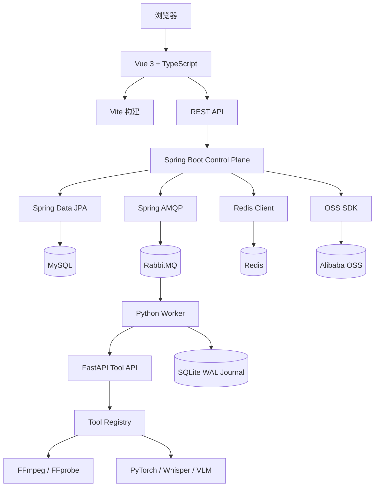

## 17. Java 部分：如何理解 Control Plane

Java 部分不是“调用几个接口”的薄后端，而是整个系统的控制面。理解它时可以分成四层：

```text
HTTP Controller
    ↓ 参数校验、登录校验、资源归属校验
Application Service
    ↓ 创建 Workflow、推进 Task、处理 Gate、应用结果
Domain Entity / State Machine
    ↓ WorkflowRun、TaskRun、Artifact、Outbox
Repository / Infrastructure
    ↓ JPA、MySQL、RabbitMQ、Redis、OSS
```

### 17.1 Controller 层

Controller 负责协议，不负责复杂业务。例如 `WorkflowController` 处理：

- 接收项目 ID、素材 ID、时长自然语言和自动化模式；
- 调用认证服务确认当前用户；
- 调用 `ProjectService` 检查项目归属；
- 将请求交给 `WorkflowExecutionService` 或 `DynamicWorkflowPlanner`；
- 返回 Workflow ID、候选 DAG 或校验错误。

Controller 不应该直接写多张表，否则事务和领域规则会散落在 API 层。

### 17.2 Service 层

最重要的 Java 类是 `WorkflowExecutionService`。它解决的是“什么时候可以执行什么”：

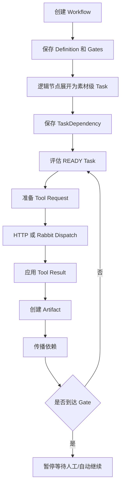

### 17.3 Entity 与状态方法

`TaskRunEntity` 不应该由外部随意设置字符串状态，而是通过诸如 `markReady()`、`markRunning()`、`scheduleRetry()`、`markFailed()` 的领域方法改变状态。这样可以把合法状态转换集中起来。

```text
TaskRunEntity
  ├─ status
  ├─ attempt
  ├─ retryCount
  ├─ nextAttemptAt
  ├─ progress
  ├─ errorMessage
  └─ toolExecution 映射
```

`WorkflowRunEntity` 保存整体进度、当前 Gate、自动化模式和最终状态。`ArtifactEntity` 保存对象引用及内容哈希，而不是把大文件塞进 MySQL。

### 17.4 Repository、事务和锁

典型事务边界如下：

```text
@Transactional
  读取并锁定 Workflow
  读取并锁定 Task
  更新 Task 状态
  写入 ToolExecution / Artifact / Outbox
  评估 Workflow
提交事务
```

并发回调可能同时到达，所以状态更新和 Workflow 收敛需要数据库锁或幂等判断。`@Transactional(readOnly = true)` 的查询不能修改业务状态；消息发布发生在事务提交之后，避免把未提交状态暴露给 Worker。

### 17.5 Java 学习路线

新人可以按这个顺序练习：

1. 阅读一个简单的 `ProjectController`；
2. 跟踪 `createMultiAssetAnalysisRun()`；
3. 阅读 `expandTasks()` 理解逻辑 DAG 如何展开；
4. 阅读 `evaluateWorkflow()` 理解依赖传播；
5. 阅读 `prepareDispatch()` 理解 Tool 请求；
6. 阅读 `applyToolResult()` 理解 Artifact 和下游 Task；
7. 最后阅读 Outbox 和 Rabbit 拓扑。

## 18. Python 部分：如何理解 Tool Service

Python 部分可以看成一个“受 Control Plane 管理的工具运行时”：

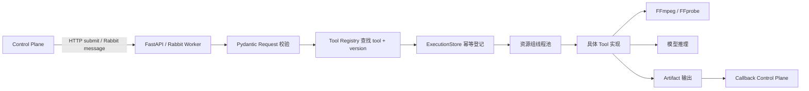

### 18.1 FastAPI 入口

FastAPI 提供：

- Tool 执行提交 API；
- 执行状态查询 API；
- 健康检查；
- Prometheus 指标；
- 应用生命周期中启动和停止 Rabbit Worker。

FastAPI 不是业务 Workflow 的拥有者。它只知道执行请求、executionId、状态、进度和输出。

### 18.2 Tool Registry

Registry 是 Python 侧的能力白名单：

```text
toolName + version
       ↓
manifest()
       ├─ 输入 Artifact 类型
       ├─ 输出 Artifact 类型
       ├─ 参数 Schema
       ├─ 资源组
       └─ execute(request)
```

Java 的 `toolName`、`toolVersion`、输入类型和 Python Registry 必须保持一致。否则会出现“DAG 校验通过但执行时找不到工具”的跨服务契约错误。

### 18.3 ExecutionStore

`ExecutionStore` 使用 SQLite WAL 保存：

- `executionId`；
- 幂等键；
- 原始请求；
- QUEUED/RUNNING/SUCCEEDED/FAILED 状态；
- 进度；
- 输出 Artifact；
- 错误和 stderr 摘要。

它的作用是让 Tool Service 重启后可以恢复未完成执行，而不是成为项目的主数据库。

### 18.4 资源组并发

并发调节有三个层次：资源组槽位、重任务总上限和 RabbitMQ `prefetch`。当前 Compose 默认 `LIGHT=4`、`MEDIA=3`、`MODEL=2`、`RENDER=2`、`HEAVY=4`、`prefetch=2`。8GB 内存的本机学习环境建议先保持该值；如果要横向扩展，先为每个副本规划独立的 ExecutionStore（或改为共享的持久化执行存储），再使用多个消费者连接同一队列。`prefetch` 只是未 ACK 消息数，不等于执行线程数。

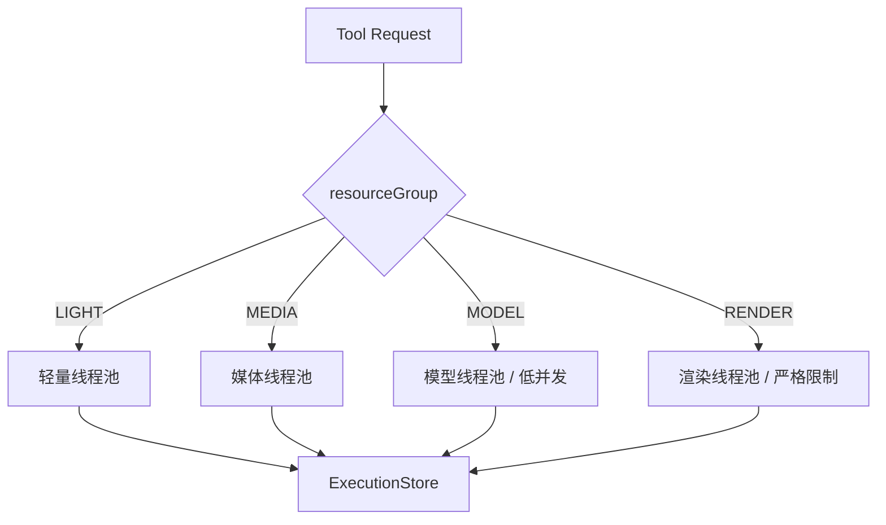

资源限制的目的不是降低性能，而是把有限内存、CPU 和模型资源分配给不会互相拖垮的任务。Render 和 MODEL 通常比 LIGHT 更需要独占容量。

### 18.5 Python 学习路线

1. 阅读 `app/core/models.py`，理解请求和响应模型；
2. 阅读 `app/registry/`，理解 Tool 注册；
3. 阅读 `app/execution/service.py`，理解提交、幂等和线程池；
4. 阅读一个简单 Tool，例如 `video_probe`；
5. 再阅读 `video_render`，理解输入物化和 FFmpeg；
6. 最后阅读 `rabbit_worker.py`，理解消息消费和 ACK。

## 19. 业务理解：用户真正看到的是什么

技术组件最终服务于以下业务对象：

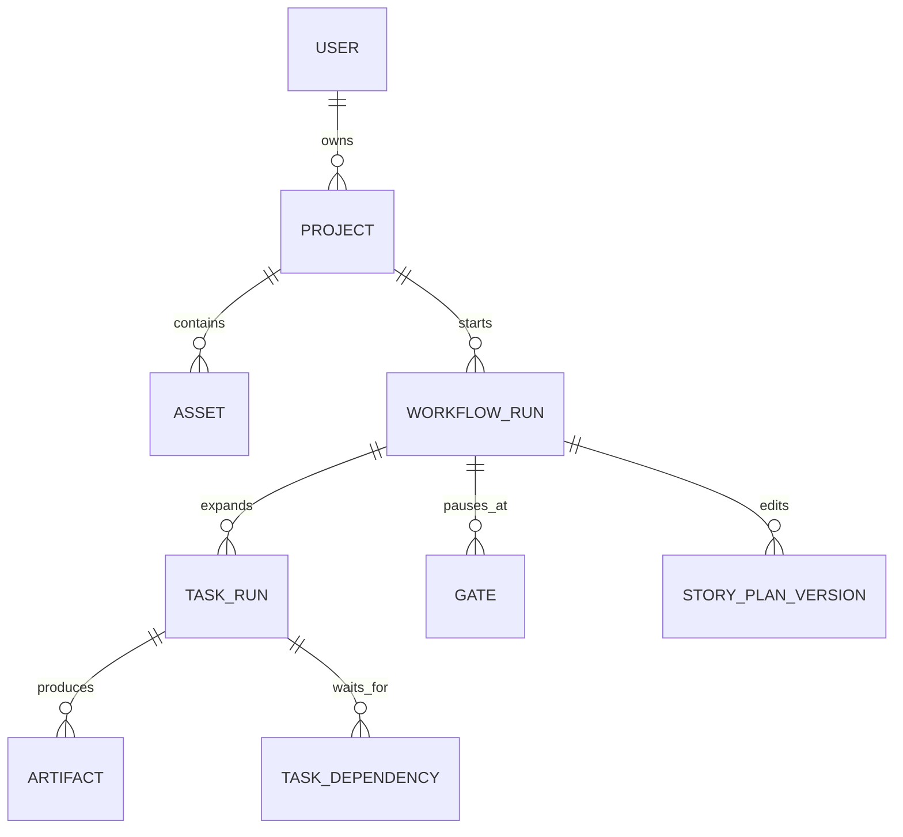

业务上可以这样理解：

- **项目**：一个用户的创作空间；
- **素材**：用户上传的原始视频、音频或图片；
- **Workflow**：一次成片尝试，不等同于项目本身；
- **Task**：Workflow 中一个可执行步骤；
- **Artifact**：某一步产出的不可变结果；
- **Gate**：需要用户判断或确认的业务节点；
- **版本**：用户编辑 Story Plan/Timeline 后产生的新 Artifact。

最重要的业务关系是：项目可以有多个 Workflow，Workflow 可以有多个版本化 Artifact，旧版本不能被覆盖。

## 20. 端到端数据流图

### 20.1 素材上传数据流

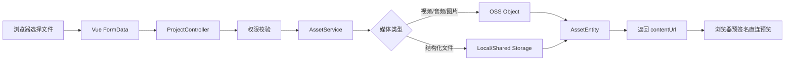

### 20.2 DAG 到 Task 数据流

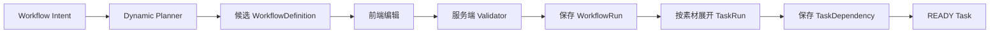

### 20.3 Task 到 Artifact 数据流


### 20.4 审计页面数据流

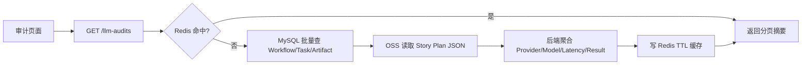

## 21. 动态 DAG 交互和后端执行的区别

```text
前端画布交互：
  节点位置、缩放、选中、连线、删除、恢复默认
  ↓
只是用户正在编辑的 Draft
  ↓ 点击“确认 DAG”
后端定义：
  节点是否合法、工具是否存在、依赖是否完整、是否有环
  ↓ 校验通过
运行时执行：
  创建 WorkflowRun / TaskRun / Dependency
```

因此前端拖动一个卡片不会立即执行任务，也不应该自动修改运行中的 Workflow。执行开始后，拓扑冻结；如果用户想改变拓扑，应创建新的 Workflow。

## 22. 学习项目的推荐实验

新人可以通过以下实验理解架构，而不需要一开始阅读所有代码：

1. **关闭 RabbitMQ**：设置 `RABBITMQ_ENABLED=false`，观察 HTTP 回退路径；
2. **关闭 Redis**：设置 `REDIS_ENABLED=false`，观察草稿/审计是否仍能读取；
3. **模拟重复消息**：向同一队列发送相同 `idempotencyKey`，观察执行不会无限生成结果；
4. **模拟 Worker 崩溃**：在 ACK 前停止 Worker，观察 RabbitMQ 重投；
5. **删除一个可选 Artifact**：观察字幕或 BGM 如何降级；
6. **删除一个必需 Artifact**：观察下游 Task 如何阻断；
7. **编辑 Story Plan**：比较新旧 Artifact 的 contentHash 和 producerTaskRunId；
8. **查看 RabbitMQ 管理台**：观察消费者数量、Ready 消息和 DLQ；
9. **查看 Actuator/Prometheus**：观察 Workflow Counter 与 Task Timer；
10. **上传两个视频**：对照前端逻辑节点和数据库实际 Task 数量。

## 23. 一句话总结

这个项目的核心不是“调用了多少 AI 模型”，而是把复杂的视频生产过程建模成一个有版本、有依赖、有人工 Gate、有幂等恢复能力的 Workflow：LLM 负责提出受约束的建议，Java 负责决定和记录，Python Worker 负责执行，RabbitMQ 负责可靠投递，Redis 负责加速，OSS 负责保存媒体，MySQL 负责最终真相。

## 24. 系统边界：哪些事情由谁负责

新人最容易迷惑的问题是“某个功能到底应该改哪里”。可以先用下面的责任边界判断：

| 需求 | 主要负责模块 | 不应该放在哪里 |
| --- | --- | --- |
| 增加一个页面或按钮 | `web-app` | 不在 Java Controller 中拼 HTML |
| 增加一个 API | Java `api` + Service | 不让前端直接访问 MySQL |
| 增加新的业务状态 | Java Entity/Service + Flyway | 不只在前端保存状态 |
| 增加媒体处理能力 | Python `tools` + Registry | 不在 Java 中启动 FFmpeg 子进程 |
| 增加一种 Tool 输入输出 | `contracts`、Python Manifest、Java 映射 | 不只修改一端 |
| 增加异步任务 | Java Outbox + Rabbit 拓扑 + Worker | 不把大文件塞进消息 |
| 增加临时缓存 | Redis Service | 不把最终状态只放 Redis |
| 保存媒体文件 | Artifact Storage/OSS | 不把视频二进制写入 MySQL |
| 增加数据库字段 | 新 Flyway Migration + Entity | 不修改已执行的旧 Migration |

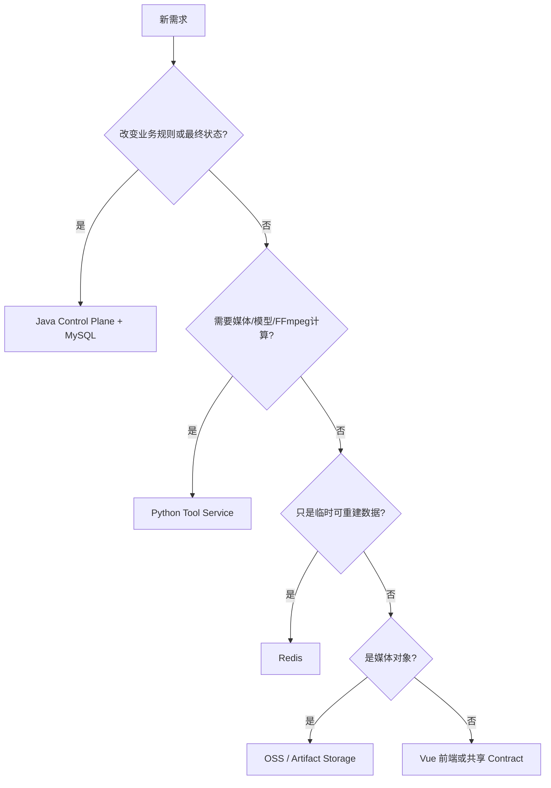

## 25. MySQL 数据模型详解

### 25.1 主要实体关系

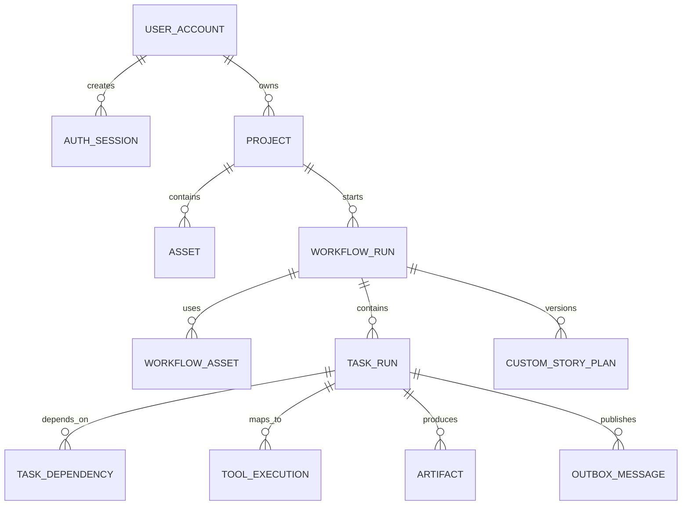

### 25.2 表的学习重点

| 表/实体 | 关键字段 | 为什么重要 |
| --- | --- | --- |
| `users` | `id`、`email`、`status` | 登录和资源所有权的根 |
| `auth_sessions` | `token_hash`、`expires_at` | Cookie Session 的数据库侧记录 |
| `projects` | `owner_user_id` | 项目隔离的第一层 |
| `assets` | `storage_uri`、`content_hash`、`status` | 原始素材引用和软删除 |
| `workflow_runs` | `definition_json`、`status`、`current_gate_key` | 一次成片尝试及冻结后的 DAG |
| `workflow_assets` | `workflow_run_id`、`asset_id`、`position_index` | 多素材的顺序和归属 |
| `task_runs` | `node_key`、`asset_id`、`status`、`attempt` | 运行时 Task 实例 |
| `task_dependencies` | `task_run_id`、`depends_on_task_run_id` | Task 图的边 |
| `tool_executions` | `idempotency_key`、`external_execution_id` | Java Task 与 Python execution 映射 |
| `artifacts` | `type`、`producer_task_run_id`、`content_hash` | 不可变生产血缘 |
| `outbox_messages` | `status`、`attempts`、`next_attempt_at` | 数据库到 Rabbit 的可靠桥梁 |
| `custom_story_plans` | `source_workflow_run_id`、`version_name` | 人工编辑版本历史 |

### 25.3 为什么 Artifact 不直接存 JSON 内容

视频、镜头列表、Story Plan、Timeline 和最终视频大小差异很大。统一将内容放在 Storage，数据库只保存元数据，可以做到：

1. MySQL 查询不会被大对象拖慢；
2. OSS 可以直接服务浏览器媒体预览；
3. Artifact 可以通过 `storage_uri` 迁移 Local/OSS；
4. `content_hash` 可以判断内容是否变化；
5. 历史版本只增加元数据和对象，不覆盖旧结果。

## 26. API、Tool Contract 和消息 Contract

### 26.1 前端 API 的三类接口

```text
用户接口：
  /api/v1/auth/*
  /api/v1/projects/*
  /api/v1/workflow-runs/*

执行前编排接口：
  /api/v1/projects/{projectId}/workflow-plans/preview
  /api/v1/projects/{projectId}/workflow-plans/validate
  /api/v1/projects/{projectId}/workflow-plans/confirm

内部执行接口：
  /internal/tool-callbacks
  /internal/tool-claims/{workflowRunId}/{taskRunId}
```

浏览器只访问 `/api/v1`，内部 Worker 才能访问 `/internal`。生产环境还应通过网络隔离和 Worker Token 双重保护内部接口。

### 26.2 Tool 请求的核心字段

```json
{
  "tool": "video.shot-detect",
  "version": "1.0.0",
  "idempotencyKey": "video.shot-detect:task-id:1",
  "inputs": {
    "video": {
      "artifactId": "asset-id",
      "storageUri": "oss://bucket/key",
      "fileName": "input.mp4"
    }
  },
  "parameters": {
    "sceneThreshold": 0.3
  },
  "callbackUrl": "/internal/tool-callbacks",
  "traceContext": {
    "workflowRunId": "workflow-id",
    "taskRunId": "task-id"
  }
}
```

Tool 请求不应包含视频二进制，只包含 Artifact 引用。Worker 根据引用从 OSS 或 Storage 物化输入。

### 26.3 Rabbit Task 消息

```json
{
  "schemaVersion": "1.0",
  "messageId": "outbox-message-id",
  "workflowRunId": "workflow-id",
  "taskRunId": "task-id",
  "resourceGroup": "MEDIA",
  "request": {
    "tool": "video.shot-detect",
    "version": "1.0.0",
    "idempotencyKey": "..."
  }
}
```

消息可以重复、可以乱序、可以延迟。Worker 必须依赖 Task 的 attempt/token 和幂等键，而不能把消息到达顺序当作业务顺序。

## 27. 完整时序：半自动模式

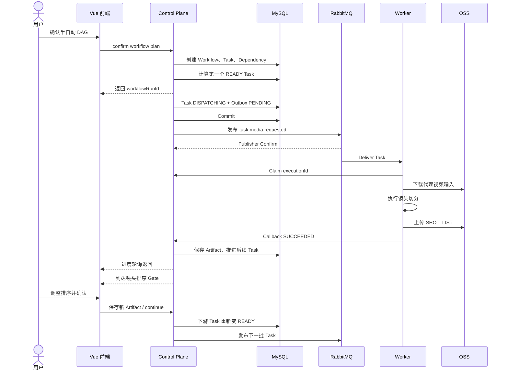

自动模式只是跳过人工暂停，Task、Artifact、Validator 和依赖传播不变。

## 28. 完整时序：Rabbit 故障与恢复

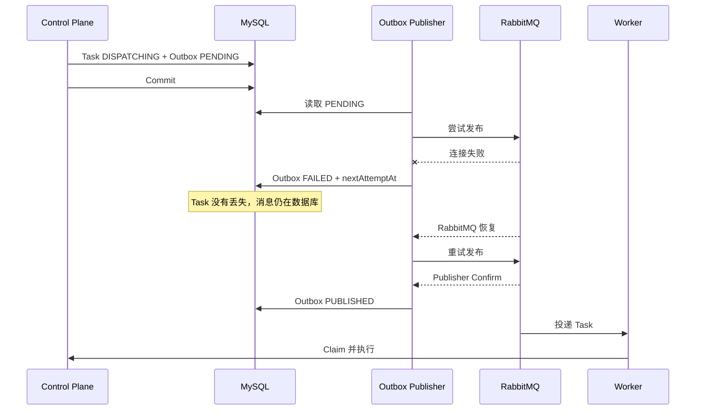

这就是为什么不能只把消息放在内存队列里：进程重启后，Outbox 仍然保留未发布请求。

## 29. Workflow 状态机详解

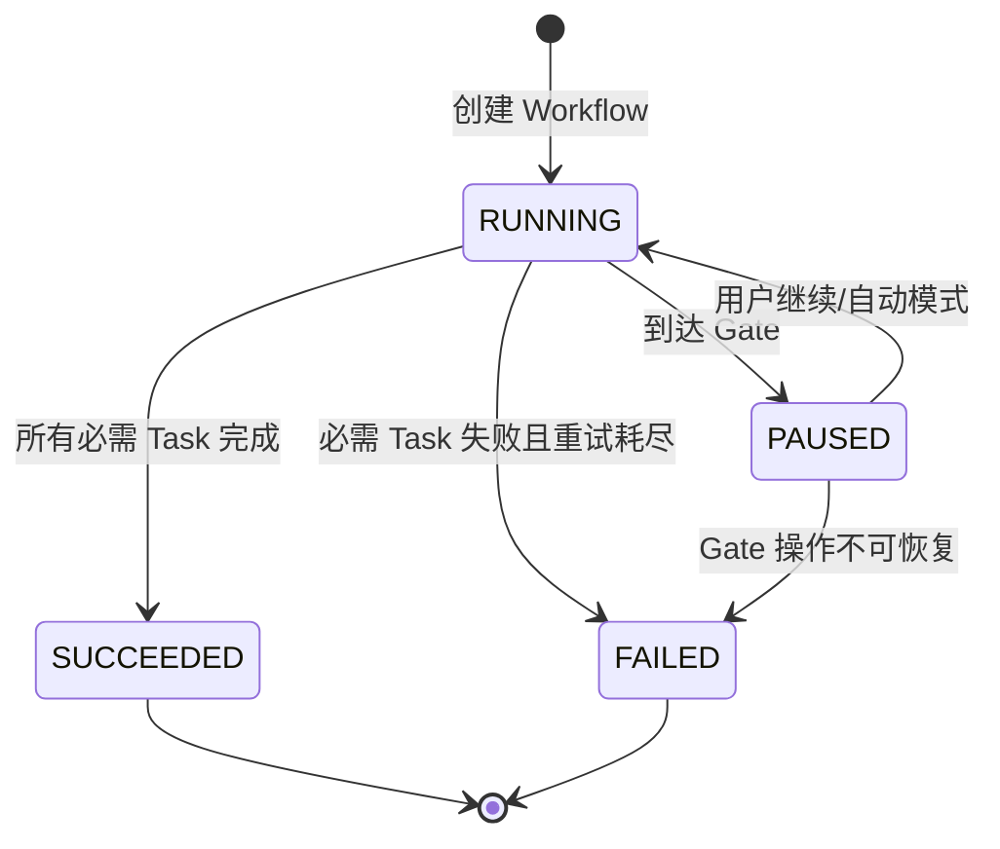

### 29.1 Task 状态和 Workflow 状态不是一回事

Task `SUCCEEDED` 只表示单个步骤完成，Workflow 还要检查：

- 其他必需 Task 是否完成；
- 可选 Task 是否允许跳过；
- 当前是否到达 Gate；
- 是否有下游依赖可以继续；
- 所有 Task 是否已经进入终态。

### 29.2 为什么必须区分 FAILED 和 SKIPPED

- `FAILED`：这个 Task 尝试执行但失败；
- `SKIPPED`：因为上游必需条件不满足，系统明确决定不执行；
- 可选增强失败通常会让下游继续，而不是让整个 Workflow 失败；
- 必需输入缺失时，系统应给出可解释的错误，而不是让 Python 收到空参数。

## 30. 从代码到业务：一个镜头是如何产生的

以 `video.shot-detect` 为例：

```text
1. 用户上传原视频，AssetEntity 保存 source storageUri
2. video.probe 读取视频时长、分辨率、音轨等信息
3. video.proxy-generate 生成低码率代理视频
4. video.shot-detect 接收 VIDEO_PROXY Artifact
5. FFmpeg/FFprobe 计算镜头边界
6. Python 生成 SHOT_LIST JSON
7. Java 在 artifacts 表登记 SHOT_LIST
8. 前端根据 Artifact contentUrl 展示镜头卡片
9. vision.*、ranking 等下游 Task 使用 SHOT_LIST
```

注意：前端看到的镜头卡片不是独立数据库表，而是根据 Artifact 元数据和 JSON 内容装配出来的业务视图。

## 31. 部署启动顺序

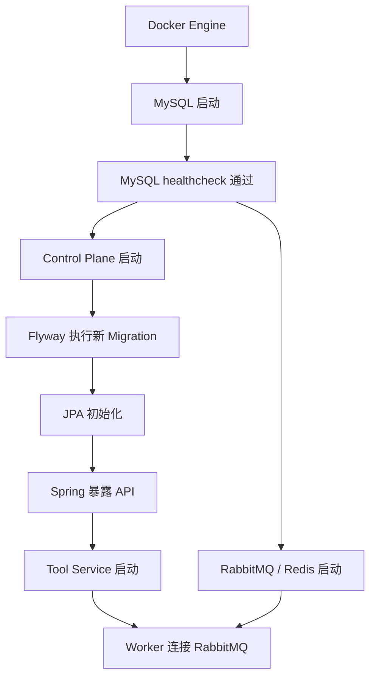

启动时短暂出现 Worker 连接失败并不一定是故障，可能只是 RabbitMQ 尚未完成启动。应观察后续日志是否出现成功连接和队列消费者，而不是看到一次连接异常就立即改代码。

## 32. 前端新人阅读方法

### 32.1 页面到 API

```text
Vue 页面
  → features 组件状态
  → src/api/*.ts
  → src/api/client.ts
  → fetch + Cookie/CSRF
  → Java Controller
```

### 32.2 动态 DAG 页面需要关注什么

新人阅读 `WorkflowTopologyPlanner.vue` 时，先不要陷入 CSS，优先找：

1. 节点数组从哪里来；
2. 边数组从哪里来；
3. 拖拽时如何转换画布坐标；
4. 连接点如何生成 Edge；
5. 删除是否需要二次点击确认；
6. 保存草稿的时机和 API；
7. 点击确认时调用哪个后端校验接口；
8. 后端失败后如何恢复画布状态。

### 32.3 审计页面为什么改成聚合 API

旧路径是：

```text
前端获取所有项目
  → 每个项目获取 Workflow 列表
  → 每个 Workflow 获取详情
  → 每个详情读取 Story Plan Artifact
```

现在的路径是：

```text
前端一次 GET /api/v1/llm-audits
  → Java 批量查询并聚合
  → Redis 缓存列表摘要
```

Redis 只能减少重复查询，不能替代后端聚合；解决 N+1 的根本措施是改变查询模型。

## 33. 测试策略

### 33.1 Java 测试

- WorkflowDefinitionValidator：节点、工具、环、输入绑定和可选依赖；
- DynamicWorkflowPlanner：自然语言时长和能力意图到 DAG 的转换；
- WorkflowExecutionService：Task 状态、重试、依赖传播和 Gate；
- Artifact/Timeline/Story Plan Validator：结构化业务输入；
- Outbox：PENDING、FAILED、发布重试和 Rabbit 拓扑。

### 33.2 Python 测试

- Registry Manifest 和版本；
- ExecutionStore 幂等和 SQLite 恢复；
- Tool 输入物化、输出发布和失败处理；
- FFmpeg Filter Graph 和字幕/BGM 降级；
- 资源组并发和模型释放。

### 33.3 集成测试

```text
最小闭环：
上传素材 → 创建 Project → 预览 DAG → 校验 DAG
→ 确认 Workflow → 执行一个轻量 Tool → 返回 Artifact
```

更完整的真实验收：

```text
多个视频 → 素材级并行分析 → Ranking → Story Plan Gate
→ Timeline Gate → BGM/字幕 → Render → 预览/下载
```

## 34. 新人接手后的第一天清单

```text
□ 确认当前目录是正式目录，不是备份目录
□ 阅读 README 和本技术架构说明
□ 执行 docker compose --profile workers ps
□ 检查 Control Plane、Tool Service 健康接口
□ 查看 RabbitMQ 队列消费者数量
□ 阅读 WorkflowDefinition 和 WorkflowExecutionService
□ 上传一个小素材，走通最小 Workflow
□ 阅读一个 Python Tool 的 manifest 和 execute
□ 在 RabbitMQ 管理台查看任务消息
□ 在 MySQL 查看 Workflow、Task、Artifact 关系
□ 关闭 Redis，验证系统仍能运行
□ 关闭 RabbitMQ，理解 HTTP 回退路径
```

## 35. 术语表

| 术语 | 含义 |
| --- | --- |
| DAG | 有向无环图，表示 Task 的依赖顺序 |
| Workflow Definition | 逻辑层的节点、边、工具版本和 Gate 定义 |
| TaskRun | Definition 展开后的实际任务实例 |
| Artifact | 不可变的 Task 输出和生产血缘记录 |
| Gate | 用户审核或业务暂停点 |
| Attempt | Task 的执行尝试编号 |
| Idempotency Key | 用于识别同一次逻辑执行的稳定键 |
| Dispatch Token | 防止旧 Worker 结果覆盖新 Attempt 的令牌 |
| Outbox | 与业务事务一起写入、异步发布的消息记录 |
| Publisher Confirm | RabbitMQ 确认 Broker 已接收发布消息 |
| ACK | Worker 告诉 RabbitMQ 可以确认消费消息 |
| DLQ | Dead Letter Queue，处理 Poison message 或无法消费的消息 |
| Materialize | 将 OSS Artifact 下载为 Worker 本地可读文件 |
| Manifest | Tool 的名称、版本、输入、输出和参数契约 |
| N+1 | 先查一批对象，再为每个对象逐个查询的低效访问模式 |
| TTL | 缓存自动过期时间 |

## 36. 最终理解目标

新人不需要一开始记住每个 Tool 的算法，也不需要立刻理解全部 FFmpeg 参数。完成接手的标准是能够清楚回答以下问题：

1. 一个用户请求如何变成 Workflow；
2. 一个逻辑节点如何展开成多个 Task；
3. Task 为什么现在能执行、为什么必须等待；
4. Task 结果如何变成 Artifact 并推动下游；
5. RabbitMQ 失败、Worker 崩溃、回调丢失时如何恢复；
6. 哪些数据在 MySQL、RabbitMQ、Redis、OSS 和 SQLite 中；
7. 修改一个 Tool 时需要同步哪些 Contract；
8. 修改动态 DAG 时为什么必须同时考虑前端、Planner、Validator 和执行展开；
9. 为什么 Artifact 不能覆盖；
10. 为什么系统保留 HTTP 和 Redis fallback。

如果能够沿着“用户 → 前端 → Control Plane → Task → MQ/HTTP → Worker → Artifact → 下游 Task”的链路定位问题，就已经掌握了这个项目的核心架构。
